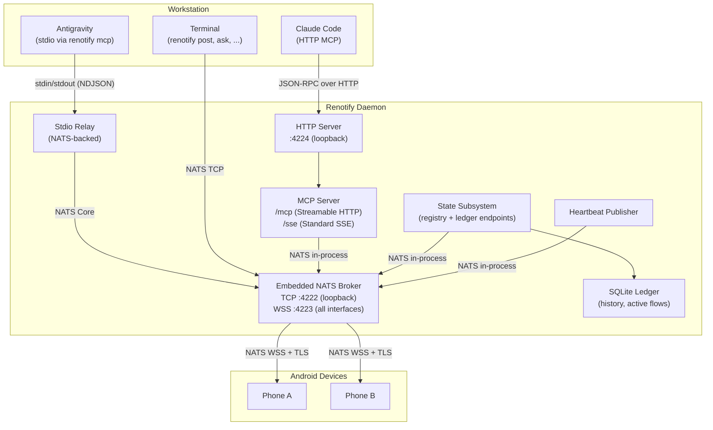
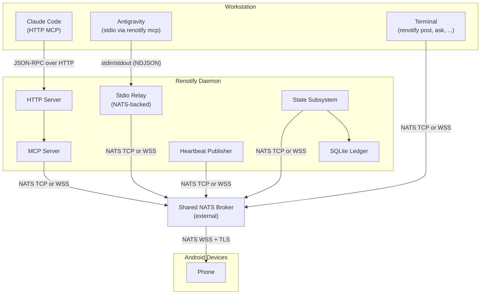
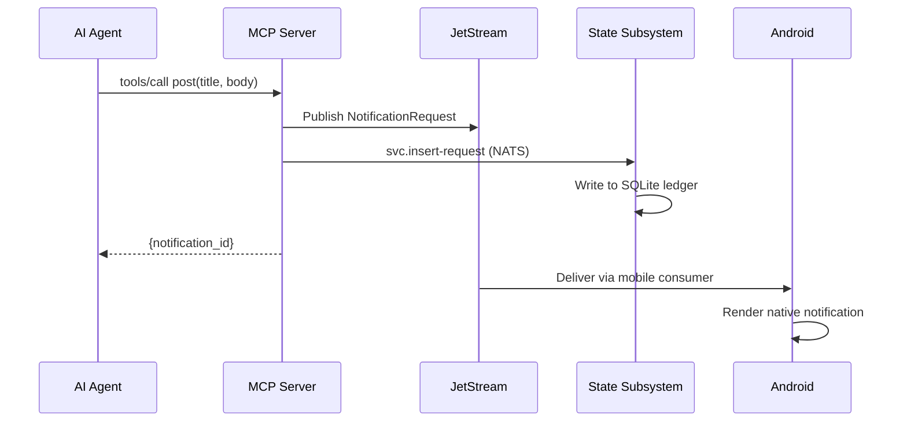
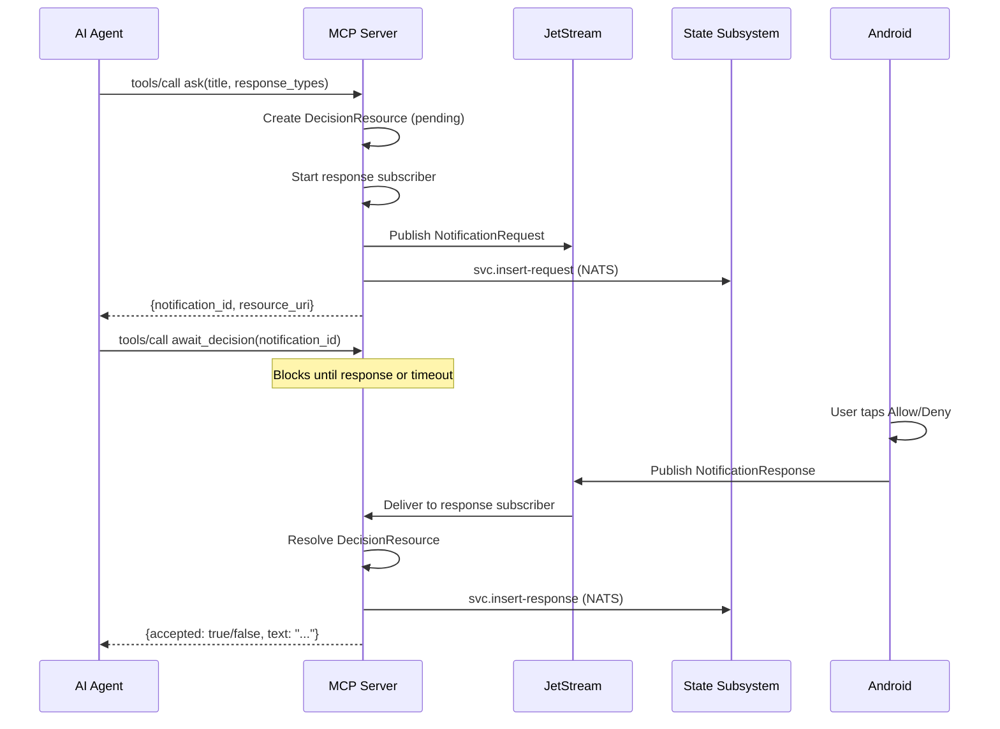
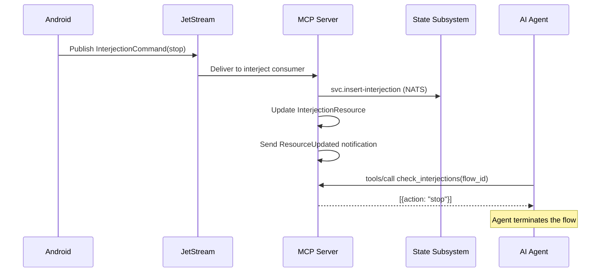

# Renotify Architecture

## System Context

Renotify is a human-in-the-loop notification system for
software development workflows. It bridges the gap between
autonomous AI agents (or long-running pipelines) that need
human decisions and the developer who may not be at the
terminal.

The developer's Android phone becomes a remote control
surface: notifications arrive as native Android alerts,
the developer taps a response, and the decision routes back
to the originating agent or script — all within seconds.

## Problem Space

Modern development increasingly involves autonomous agents
(Claude Code, Antigravity, Cursor) that run for extended
periods. These agents encounter decision points — permission
requests, deployment approvals, error triage — where they
must pause and wait for human input.

Without Renotify, the developer must stay at the terminal
or periodically check back. With multiple agents across
multiple projects, this becomes untenable.

Key challenges Renotify addresses:

- **Routing**: Multiple concurrent agents need human
  decisions. Each response must route back to the correct
  pipeline without confusion.
- **Mobility**: The developer may be away from the desk.
  Decisions must reach them wherever they are.
- **Security**: Notifications cross untrusted networks
  (WiFi, mobile data). End-to-end TLS with certificate
  pinning prevents interception.
- **Multiplexing**: Several projects, several agents, and
  potentially several devices — all converging on one
  daemon.

## Design Principles

**Single binary distribution.** The CLI embeds the Android
APK. Run `renotify app apk serve` to serve it over HTTP
with a QR code. No app store required.

**NATS as universal transport.** All inter-subsystem message
routing uses NATS — JetStream for durable delivery
(notifications, responses, lifecycle events) and Core NATS
for ephemeral traffic (heartbeats, service queries, device
control). Subsystems within the daemon process communicate
via NATS, not via shared memory or direct function calls.
This ensures every subsystem can operate as a NATS client
regardless of whether the broker is embedded or shared.

**MCP as the agent integration standard.** AI agents
connect via the Model Context Protocol. The daemon serves
Streamable HTTP (`/mcp`), Standard SSE (`/sse`), and stdio
(`renotify mcp`) transports simultaneously from a single
`mcp.Server` instance.

**Flows as the unit of work.** A "flow" represents one
logical task — not a connection, not a session. Flows are
identified by globally unique IDs, tracked in an SQLite
ledger, and reaped automatically after inactivity.

**Activity-based reaping.** No manual cleanup. Flows that
receive no tool calls for 15 minutes are terminated
automatically. Agents can call `refresh_flow` to keep
long-running flows alive.

**State management via NATS services.** The state subsystem
is the sole authority for all reads from and writes to the
SQLite ledger. It exposes its capabilities via NATS
request-reply endpoints (`svc.*`). No other subsystem holds
a direct reference to the database (R-CLI-20, R-CLI-21).

## System Block Diagram (Embedded Broker)

The default deployment: a solo developer running the daemon
with its embedded NATS broker. The daemon process contains
all subsystems. Internal subsystem communication uses the
NATS in-process transport (a `net.Pipe()` between the
client and the embedded server). External clients (CLI
commands, mobile app) connect via TCP or WSS.



## Shared Broker Deployment

When the embedded broker is disabled (`broker.enabled: false`),
the daemon connects to an external shared NATS broker. The
`shared_broker.url` field accepts `nats://` (TCP), `tls://`
(TCP + TLS), or `wss://` (WebSocket + TLS) schemes. All NATS
subjects, payload formats, and subsystem behaviour are
identical — the only difference is the transport between
subsystems and the broker.

This enables two additional topologies:

- **Collocated + shared broker.** The daemon process contains
  all subsystems but connects to an external broker instead of
  using in-process transport. Useful when a team shares a
  centralised NATS cluster.
- **Separated + shared broker.** The MCP server and state
  subsystem run in different processes, both connected to the
  shared broker. The MCP server accesses state exclusively via
  NATS request-reply — it has no import dependency on the
  ledger package.



The mobile app behaves identically regardless of broker
topology — it connects via NATS WSS to whichever broker the
provisioning QR code specifies.

## Notification Flow (post)

A fire-and-forget notification sent by an agent to the
developer's phone.



## Interactive Ask Flow

An agent requests a human decision and waits for the
response.



## Interjection Flow

The developer proactively sends a signal (stop, note) to
a running agent from the mobile dashboard.



## Port Architecture

| Port | Protocol | Bind Address | Purpose | TLS |
|:-----|:---------|:-------------|:--------|:----|
| 4222 | NATS TCP | `127.0.0.1` | CLI commands and external clients | No (loopback) |
| 4223 | NATS WSS | `0.0.0.0` | Mobile device connections | Yes (self-signed, TOFU pinning) |
| 4224 | HTTP | `127.0.0.1` | MCP server (`/mcp`, `/sse`) | No (loopback) |

Separate trust boundaries justify separate listeners. Mobile
connections cross untrusted networks and require TLS. CLI and
MCP connections stay on loopback and need no encryption.

The daemon's own subsystems connect to the embedded broker via
in-process transport (`nats.InProcessServer`), bypassing TCP
entirely. The TCP listener on port 4222 serves only external
CLI processes (`renotify post`, `renotify ask`, etc.).

## NATS Subject Namespace

All subjects follow the pattern:

```
resystems.renotify.{username}.{scope}.{id}.{event}
```

### Flow-scoped subjects (JetStream)

| Subject | Direction | Purpose |
|:--------|:----------|:--------|
| `...flow.{id}.request` | MCP Server → Mobile | Notification delivery |
| `...flow.{id}.response` | Mobile → MCP Server | User's decision |
| `...flow.{id}.lifecycle` | MCP Server → State Subsystem | Flow state changes |
| `...flow.{id}.interject` | Mobile → MCP Server | Stop/note signals |

### State service subjects (Core NATS Request-Reply)

| Subject | Callers | Purpose |
|:--------|:--------|:--------|
| `...svc.flows` | MCP Server, CLI, Mobile | Active flow queries |
| `...svc.history` | CLI, Mobile | History queries |
| `...svc.insert-request` | MCP Server | Insert notification request |
| `...svc.insert-response` | MCP Server | Insert notification response |
| `...svc.insert-interjection` | MCP Server | Insert interjection audit |
| `...svc.update-activity` | MCP Server | Update flow activity timestamp |

### Ephemeral subjects (Core NATS)

| Subject | Direction | Purpose |
|:--------|:----------|:--------|
| `...daemon.{id}.heartbeat` | Heartbeat Publisher → Mobile | Dashboard updates |
| `...device.{id}.control` | Daemon → Mobile | Silent mode, etc. |
| `...mcp.{id}.c2s` | CLI → MCP Server | Stdio MCP relay |
| `...mcp.{id}.s2c` | MCP Server → CLI | Stdio MCP relay |
