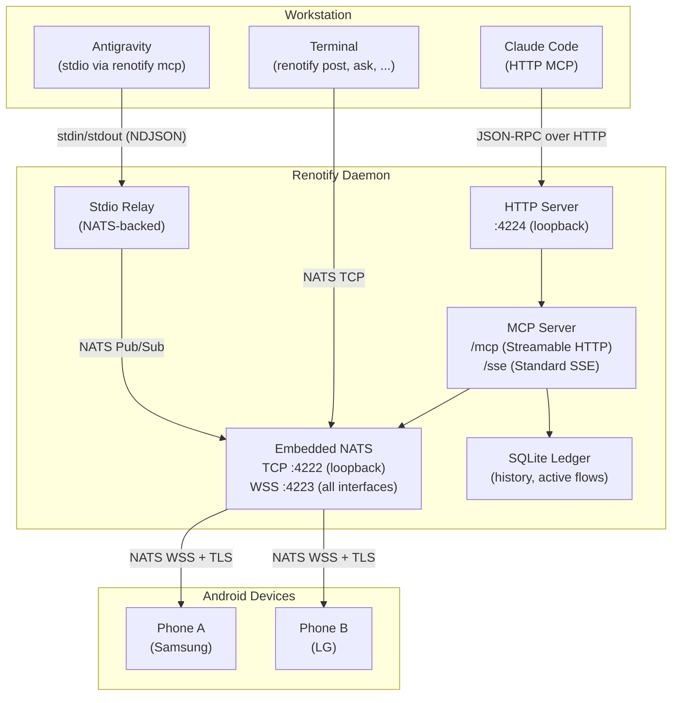
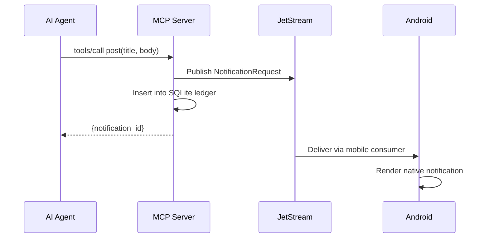
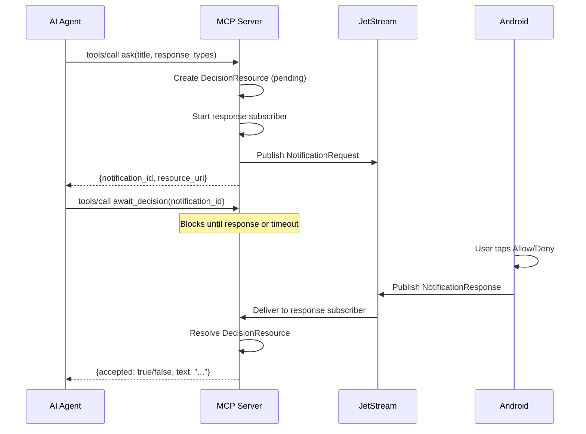
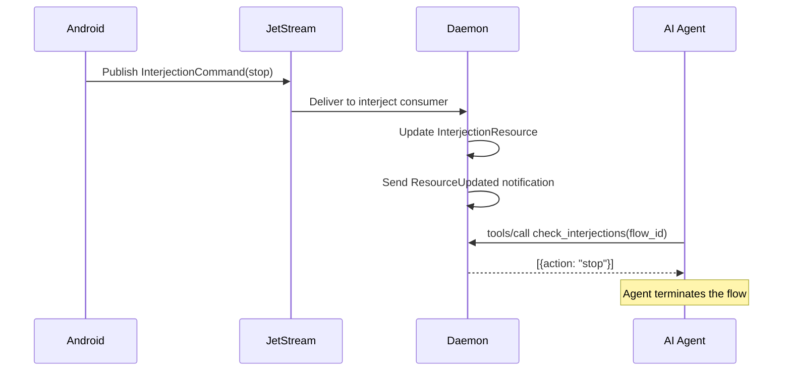

# Renotify Architecture

## System Context

Renotify is a human-in-the-loop notification system for
software development workflows. It bridges the gap between
autonomous AI agents (or long-running pipelines) that need
human decisions and the developer who may not be at the
terminal.

The developer's Android phone becomes a remote control
surface: notifications arrive as native Android alerts,
the developer taps a response, and the decision routes back
to the originating agent or script — all within seconds.

## Problem Space

Modern development increasingly involves autonomous agents
(Claude Code, Antigravity, Cursor) that run for extended
periods. These agents encounter decision points — permission
requests, deployment approvals, error triage — where they
must pause and wait for human input.

Without Renotify, the developer must stay at the terminal
or periodically check back. With multiple agents across
multiple projects, this becomes untenable.

Key challenges Renotify addresses:

- **Routing**: Multiple concurrent agents need human
  decisions. Each response must route back to the correct
  pipeline without confusion.
- **Mobility**: The developer may be away from the desk.
  Decisions must reach them wherever they are.
- **Security**: Notifications cross untrusted networks
  (WiFi, mobile data). End-to-end TLS with certificate
  pinning prevents interception.
- **Multiplexing**: Several projects, several agents, and
  potentially several devices — all converging on one
  daemon.

## Design Principles

**Single binary distribution.** The CLI embeds the Android
APK. Run `renotify app apk serve` to serve it over HTTP
with a QR code. No app store required.

**NATS as universal transport.** All message routing uses
NATS — JetStream for durable delivery (notifications,
responses, lifecycle events) and Core NATS for ephemeral
traffic (heartbeats, service queries, device control).

**MCP as the agent integration standard.** AI agents
connect via the Model Context Protocol. The daemon serves
Streamable HTTP (`/mcp`), Standard SSE (`/sse`), and stdio
(`renotify mcp`) transports simultaneously from a single
`mcp.Server` instance.

**Flows as the unit of work.** A "flow" represents one
logical task — not a connection, not a session. Flows are
identified by globally unique IDs, tracked in an SQLite
ledger, and reaped automatically after inactivity.

**Activity-based reaping.** No manual cleanup. Flows that
receive no tool calls for 15 minutes are terminated
automatically. Agents can call `refresh_flow` to keep
long-running flows alive.

## System Block Diagram



## Notification Flow (post)

A fire-and-forget notification sent by an agent to the
developer's phone.



## Interactive Ask Flow

An agent requests a human decision and waits for the
response.



## Interjection Flow

The developer proactively sends a signal (stop, note) to
a running agent from the mobile dashboard.



## Port Architecture

| Port | Protocol | Bind Address | Purpose | TLS |
|:-----|:---------|:-------------|:--------|:----|
| 4222 | NATS TCP | `127.0.0.1` | CLI and daemon internal | No (loopback) |
| 4223 | NATS WSS | `0.0.0.0` | Mobile device connections | Yes (self-signed, TOFU pinning) |
| 4224 | HTTP | `127.0.0.1` | MCP server (`/mcp`, `/sse`) | No (loopback) |

Separate trust boundaries justify separate listeners.
Mobile connections cross untrusted networks and require TLS.
CLI and MCP connections stay on loopback and need no
encryption.

## NATS Subject Namespace

All subjects follow the pattern:

```
resystems.renotify.{username}.{scope}.{id}.{event}
```

| Subject | Transport | Direction | Purpose |
|:--------|:----------|:----------|:--------|
| `...flow.{id}.request` | JetStream | Daemon → Mobile | Notification delivery |
| `...flow.{id}.response` | JetStream | Mobile → Daemon | User's decision |
| `...flow.{id}.lifecycle` | JetStream | Daemon → Registry | Flow state changes |
| `...flow.{id}.interject` | JetStream | Mobile → Daemon | Stop/note signals |
| `...daemon.{id}.heartbeat` | Core NATS | Daemon → Mobile | Dashboard updates |
| `...svc.flows` | Core NATS | Request-Reply | Active flow queries |
| `...svc.history` | Core NATS | Request-Reply | History queries |
| `...device.{id}.control` | Core NATS | Daemon → Mobile | Silent mode, etc. |
| `...mcp.{id}.c2s` | Core NATS | CLI → Daemon | Stdio MCP relay |
| `...mcp.{id}.s2c` | Core NATS | Daemon → CLI | Stdio MCP relay |
