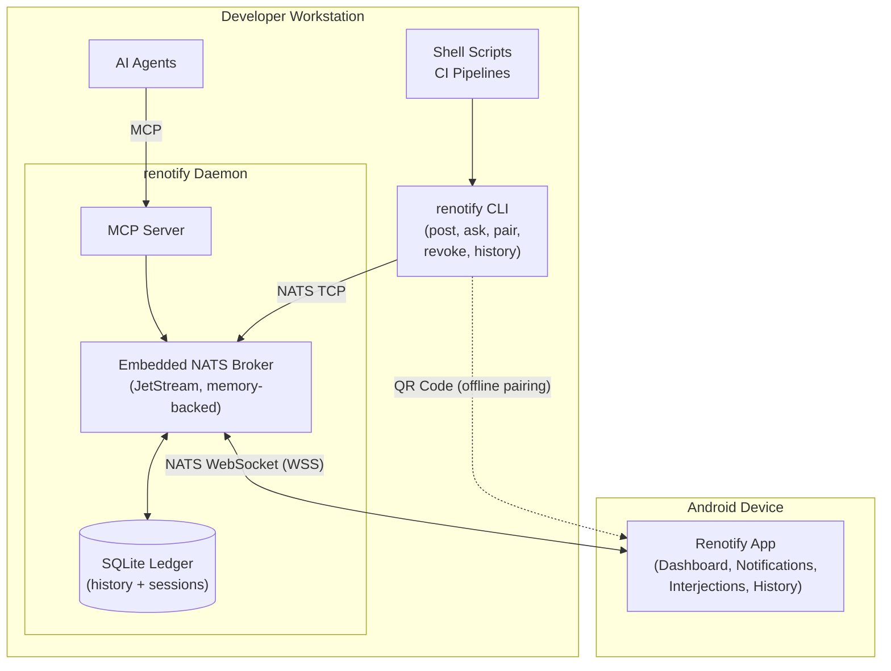

# Renotify Core Architecture — Refinement Plan

This document captures the requirements and implementation plan for building the initial version of **Renotify**. It provides a structured roadmap covering the Go CLI, the Android application, and the underlying communications required to support agent-driven software development workflows.

---

## 1. Context Analysis Summary

Renotify aims to simplify sending notifications to multiple devices, specifically catering to software development workflows where autonomous agents or multiple active pipelines need to request user intervention, feedback, or simply notify the user of state changes.

The system consists of two main components:
1. **Go CLI**: A command-line tool for sending notifications and receiving responses. It supports single-shot (fire-and-forget), interactive (wait for response), and history (view past events) modes.
2. **Android Application**: The receiving end that displays notifications to the user and captures their responses to send back to the originating pipeline.

### 1.1 Concept of Operations (ConOps) [CONOPS-01]
Renotify is designed for developers who employ autonomous agents or long-running pipelines (e.g., CI/CD builds, data migrations) that occasionally require asynchronous human intervention or awareness.

In a typical day-to-day operational concept:
* **The Actors:** The system relies on the orchestrated interaction of several distinct human and machine components:
  * **The Human Developer:** The primary stakeholder who provisions the environment, reviews inbound requests remotely, and issues decisions via their mobile device.
  * **The Originating Pipeline / Agent:** The system initiating automated work (e.g., CI/CD scripts calling the CLI or AI assistants querying the MCP server) that triggers an alert or blocks awaiting human intervention.
  * **The Renotify Daemon:** The local host process that orchestrates routing, manages the embedded MCP server, computes timeouts, and transacts all permanent historical records to an SQLite ledger.
  * **The NATS Message Broker:** The transport infrastructure (either the daemon's embedded server or a shared enterprise node) responsible for securing websocket connections and temporarily buffering state via JetStream.
  * **The Android Mobile Client:** The smartphone application that maintains a persistent background WebSocket connection, renders payloads into native UI components, and captures the user's rich interactions.
* **The Context:** The system requires entirely ephemeral execution on the sender side (publishing a payload and waiting) combined with a persistent, low-overhead background connection on the mobile device.
* **The Life-Cycle Execution:** A developer provisions the local environment by running `renotify daemon` (often managed via systemd). From there, two distinct workflows are supported:
  * **Traditional CLI Flow:** A shell script or build pipeline uses the `renotify ask` command to request input, blocking execution. Once the developer provides a decision on their phone (e.g., "Approve/Reject" or free-form text), the response routes back to the CLI process, which exits with the result, allowing the script to proceed.
  * **Native MCP Flow:** An autonomous AI agent connects to the `renotify daemon`'s embedded MCP server. The agent invokes a tool to request input natively and suspends execution. The rich response is routed back via the MCP protocol without relying on shell command execution.
  * In both flows, if the developer does not respond within the configurable timeframe, the request times out and the originating process is informed of the failure. All interactions are logged locally for auditability.

### 1.2 Primary Operational Workflows
Derived from the ConOps, the following basic workflows describe how the actors interact across the system's boundaries. They inform the detailed functional and technical requirements.

**Workflow 1: Provisioning & Secure Pairing**
The developer runs a pairing command (e.g., `renotify pair`) on their workstation. The CLI calculates connection details, adjusting for whether the workstation is connecting to a shared enterprise NATS broker or relying on the local embedded daemon (discovering its local IP address and generating a self-signed TLS certificate if necessary). The CLI outputs an ASCII QR code to the terminal. The developer scans the QR code with the Renotify Android app, which securely provisions connection parameters (IP, unified port for NATS/MCP, auth token, and specific certificate pinning data). The app initiates connection attempts and manages robust reconnection logic moving forward.

**Workflow 2: Ephemeral Fire-and-Forget Notification**
An automated script or agent fires an informational alert. Under the hood, the daemon bridges the message via its embedded memory-backed JetStream with a relatively short TTL (minutes to hours). This provides resilience against temporary mobile connection drops (e.g., switching from WiFi to Cellular) without committing message queues to the filesystem. When the Android app reconnects, it retrieves any buffered notifications and renders them natively. Permanent historical logging is strictly handled by the daemon's local SQLite ledger.

**Workflow 3: Blocking Interactive Prompt**
A CI/CD script (via `renotify ask`) or an AI agent (via MCP) requests critical input with a strict timeout. The dispatcher blocks execution and waits for feedback. When the developer reviews the context on their phone and responds (e.g., tapping "Approve"), the rich result is routed back, unblocking the caller. If the timeout expires before a response is received, the operation fails fast—signalling an error via a non-zero UNIX exit code (CLI flow) or an explicit tool error response (MCP flow).

**Workflow 4: Remote Audit & History Retrieval**
To review past notifications on the mobile device beyond what is actively buffered on the broker, the Android app executes a standard Core NATS Request-Reply call directed at the daemon. The daemon queries its underlying SQLite historical ledger and returns the requested payload, offloading all permanent storage concerns from the broker infrastructure.

**Workflow 5: Asynchronous Workspace Interjection**
A developer monitoring an actively executing workspace notices an issue, wants to halt operations, or wishes to leave a specific directive for the pipeline. Without waiting for a blocking `ask` prompt, the developer proactively issues a "Stop" command or a free-form interjection from the Android app. This signal is routed via NATS directly back to the workspace environment, where a listening agent or daemon intercepts it either to gracefully terminate the pipeline immediately or to alter its ongoing execution based on the delayed human context.

### 1.3 High-Level Functional Needs
Derived from CONOPS-01:
* **N-01 [Context Transmission]:** The system must ingest, route, and deliver structured data.
* **N-02 [Human Interruption]:** The system must present information natively and prioritise disruptions.
* **N-03 [Decision Feedback]:** The system must capture rich responses (informational, constrained choice, free-form text) and route them back to the source.
* **N-04 [Lifecycle State]:** The system must handle non-responses (timeouts) and log interactions locally for auditability.
* **N-05 [Proactive Interjection]:** The system must allow the human receiver to emit asynchronous, unprompted control signals or feedback upstream to terminate, pause, or alter the trajectory of active pipelines.

### 1.4 Architectural Considerations
To connect the CLI and the Android app, a reliable transport layer is necessary. This system will exclusively use NATS as the central message broker, deliberately excluding alternatives like MQTT or gRPC. This refinement plan focuses on defining the interfaces, components, and integration points for the MVP built around NATS.

**Multiplexing & Multi-tenancy**
The architecture deliberately relies on the NATS subject namespace to multiplex traffic across multiple operational dimensions:
1. **Shared Broker Level:** A single centralised NATS broker (in an enterprise setting) can support multiple distinct `renotify` daemons running for different users concurrently.
2. **Daemon Level:** A single local `renotify daemon` acts as a multiplexer for any number of concurrent automation pipelines, active AI agent sessions, or local file workspaces. It intelligently routes all of these isolated context streams securely up to the user's single authenticated Android remote app.

**High-Level Architecture**

The diagram below shows the major system components and the transport boundaries between them. On the developer's workstation, shell scripts and AI agents are the originating callers. Scripts invoke the `renotify` CLI which connects to the daemon over native NATS TCP; AI agents connect directly to the daemon's embedded MCP server. The daemon orchestrates all routing, timeout management, and persistent audit logging through its SQLite ledger. It bridges outbound messages to the Android mobile client over a NATS WebSocket (WSS) connection secured via TLS certificate pinning established during the QR pairing flow.

The embedded NATS broker and MCP server are independently toggleable (R-CLI-02, R-CLI-03). When the embedded broker is disabled, the daemon connects to an external centralised NATS broker instead, supporting shared enterprise deployments while keeping the same component topology.

### 1.5 Key Definitions

The following terms have precise meanings throughout this document and the implementation:

* **Workspace** — A named local project directory or working tree from which one or more automation pipelines originate. Workspaces are long-lived and map to a developer's active projects (e.g., `~/projects/renotify`). A single daemon may manage traffic for many workspaces concurrently.
* **Session** — A single, time-bounded execution of a pipeline or agent conversation within a workspace. Sessions are ephemeral: they begin when a pipeline registers (via `register_session`) and end when it terminates, completes, or is reaped for staleness. A workspace may host many concurrent sessions.

The NATS subject hierarchy encodes both levels (see R-API-07), and the Android UI groups notifications first by workspace, then by session within that workspace.

---

## 2. Traceable Requirements

*Note: Attributes such as Originator, Owner, Verification Status, Validation Status, Priority, Criticality, and Risk are assumed to be "Initial Draft" / "Standard" for MVP unless explicitly stated otherwise to maintain document readability.*

### 2.1 Packaging & Integration

#### R-PKG-01: Build Orchestration
**Statement:** The project must use Makefiles as the primary build orchestrator. The root `Makefile` will delegate to subsystem-specific build tools (e.g., `go build` for the CLI, Gradle for Android APK creation).
* **Rationale (A1):** Makefiles are universally supported, keep CI/CD pipelines simple, and cleanly delegate domain-specific tasks.
* **Trace to Parent (A4):** N-01
* **Allocation (A8):** System-wide Repository
* **V&V Method (A2):** Demonstration

#### R-PKG-02: Single Binary Distribution
**Statement:** The Go CLI binary must be built to contain an embedded copy of the compiled Android APK assets. The daemon must provide a mechanism to extract or download the APK for manual installation.
* **Rationale (A1):** Allows the entire system to be distributed as a single standalone executable, bypassing the need for a Google Play Store deployment. Note: this creates a build-order dependency (Android APK must be compiled before the Go binary can embed it). The Makefile should provide a `build-cli-dev` target that skips APK embedding for development iteration.
* **Trace to Parent (A4):** N-01
* **Allocation (A8):** Go CLI Application
* **V&V Method (A2):** Demonstration

### 2.2 Domain & API Definitions

#### R-API-01: Notification Payload
**Statement:** Define the core domain model for a notification (e.g., ID, Title, Body, RequiredResponseType, Priority, SourcePipeline).
* **Rationale (A1):** Necessary to standardise how agents describe their intent to the broker.
* **Trace to Parent (A4):** N-01
* **Allocation (A8):** System-wide
* **V&V Method (A2):** Inspection

#### R-API-02: Response Payload
**Statement:** Define the expected response format from the Android app (e.g., NotificationID, SelectedAction, FreeFormText, Timestamp).
* **Rationale (A1):** Allows the agent to receive rich feedback (boolean, categorical, or text).
* **Trace to Parent (A4):** N-03
* **Allocation (A8):** System-wide
* **V&V Method (A2):** Inspection

#### R-API-03: Payload Encoding
**Statement:** All message payloads must be encoded in JSON (explicitly excluding Protobuf).
* **Rationale (A1):** Simplifies integration with various AI agents and scripting tools.
* **Trace to Parent (A4):** N-01
* **Allocation (A8):** System-wide
* **V&V Method (A2):** Demonstration

#### R-API-04: Transport Protocol
**Statement:** Remote client connections to NATS (including the Android application and any client traversing a network boundary) must use WebSockets. Co-located clients (e.g., CLI commands on the same host as the daemon) may use native NATS TCP.
* **Rationale (A1):** WebSockets are required where raw TCP may be restricted (mobile networks, firewalled environments). Co-located CLI processes benefit from native TCP's lower overhead and simpler connection handling.
* **Trace to Parent (A4):** N-01
* **Allocation (A8):** System-wide
* **V&V Method (A2):** Demonstration

#### R-API-05: Global Namespace
**Statement:** The NATS subject hierarchy must use a structured prefix (`resystems.renotify.>`).
* **Rationale (A1):** Prevents collisions with other organisational traffic on a shared broker.
* **Trace to Parent (A4):** N-01
* **Allocation (A8):** System-wide
* **V&V Method (A2):** Inspection

#### R-API-06: Multi-User Support
**Statement:** The subject hierarchy must explicitly route at the `user` level (e.g., `...user.<username>.>`).
* **Rationale (A1):** Allows multiple developers to share a broker without receiving each other's notifications.
* **Trace to Parent (A4):** N-01
* **Allocation (A8):** System-wide
* **V&V Method (A2):** Demonstration

#### R-API-07: Multi-Workspace & Session Routing
**Statement:** Routing subject names must explicitly include both a `workspace` identifier and a `session` identifier to separate notifications at two distinct levels: by originating project directory and by individual pipeline run (e.g., `...workspace.{workspace}.session.{session_id}.{event_type}`).
* **Rationale (A1):** A single local daemon must seamlessly multiplex traffic from many concurrent workspaces and sessions without cross-contaminating the context presented on the developer's Android application. The two-level hierarchy enables the mobile UI to group by project and filter by pipeline run.
* **Trace to Parent (A4):** N-01
* **Allocation (A8):** System-wide
* **V&V Method (A2):** Demonstration

#### R-API-08: Provisioning Schema
**Statement:** Define the minified JSON payload structure to be encoded in the pairing QR code (containing target IP, port, token, and certificate fingerprints).
* **Rationale (A1):** A minified JSON payload is more robust over time and easier to expand with complex cryptographic parameters than a standard URI format. Standardises the secure handshake protocol required for mobile connection bootstrapping.
* **Trace to Parent (A4):** N-01
* **Allocation (A8):** System-wide
* **V&V Method (A2):** Inspection

#### R-API-09: Interjection Payload
**Statement:** Define the message structure for an asynchronous control signal originating from the Android client representing a dynamic human interjection (e.g., Workspace, SessionID, Action: "Stop" | "Note", Context).
* **Rationale (A1):** Required to structure proactive steering or termination directives.
* **Trace to Parent (A4):** N-05
* **Allocation (A8):** System-wide
* **V&V Method (A2):** Inspection

#### R-API-10: Session Lifecycle Payload
**Statement:** Define the payload schema for explicitly registering the start and termination of a distinct pipeline session (e.g., `SessionID`, `Workspace`, `Status: active|completed|failed`, `Metadata`).
* **Rationale (A1):** Establishes a formal boundary for a workflow, allowing the Android UI to easily group and filter notifications by active sessions.
* **Trace to Parent (A4):** N-04
* **Allocation (A8):** System-wide
* **V&V Method (A2):** Inspection

#### R-API-11: Error Response Payload
**Statement:** Define a generic error response payload (e.g., CorrelationID, ErrorCode, Message, Timestamp) for use when any request fails at the daemon or broker level (e.g., unroutable notification, query failure, rate-limit rejection).
* **Rationale (A1):** Standardises failure signalling across CLI and mobile flows, allowing callers and the Android app to distinguish error categories and present meaningful feedback.
* **Trace to Parent (A4):** N-04
* **Allocation (A8):** System-wide
* **V&V Method (A2):** Inspection

### 2.3 Go CLI Application

#### R-CLI-01: Daemon Service
**Statement:** Implement `renotify daemon` to optionally run the embedded NATS broker (with WebSocket support), the MCP server, or both. Must support foreground or background detached mode with file logging.
* **Rationale (A1):** Reduces infrastructure overhead by bundling the broker and server within the CLI tool.
* **Trace to Parent (A4):** N-01, N-03
* **Allocation (A8):** Go CLI Application
* **V&V Method (A2):** Demonstration

#### R-CLI-02: Embedded NATS Broker Toggle
**Statement:** The daemon must provide an explicit option (e.g., via flag or config) to enable or disable the embedded NATS broker.
* **Rationale (A1):** Allows the daemon to act exclusively as an MCP server connecting to an external centralised NATS broker if preferred.
* **Trace to Parent (A4):** R-CLI-01
* **Allocation (A8):** Go CLI Application
* **V&V Method (A2):** Test

#### R-CLI-03: Embedded MCP Server Toggle
**Statement:** The daemon must provide an explicit option (e.g., via flag or config) to enable or disable the embedded MCP server.
* **Rationale (A1):** Allows the daemon to operate strictly as a lightweight standalone message broker without unnecessarily exposing MCP capabilities.
* **Trace to Parent (A4):** R-CLI-01
* **Allocation (A8):** Go CLI Application
* **V&V Method (A2):** Test

#### R-CLI-04: Single-shot Mode
**Statement:** Implement `renotify post` for fire-and-forget toast notifications.
* **Rationale (A1):** Supports simple informational alerts that do not require human decision.
* **Trace to Parent (A4):** N-01
* **Allocation (A8):** Go CLI Application
* **V&V Method (A2):** Test

#### R-CLI-05: Interactive Mode
**Statement:** Implement `renotify ask` to send a notification with actions and block until a rich response is received.
* **Rationale (A1):** Enables human-in-the-loop workflows for AI agents.
* **Trace to Parent (A4):** N-03
* **Allocation (A8):** Go CLI Application
* **V&V Method (A2):** Test

#### R-CLI-06: Timeout Management
**Statement:** The interactive mode must support a configurable timeout, returning a standardised error to the caller if no response is received.
* **Rationale (A1):** Prevents pipelines from hanging indefinitely if the human is unavailable.
* **Trace to Parent (A4):** N-04
* **Allocation (A8):** Go CLI Application
* **V&V Method (A2):** Test

#### R-CLI-07: History Mode & Audit Logging
**Statement:** Implement `renotify history` to query and display past notifications, their resolution states, and rich text responses from a local SQLite or file-based log.
* **Rationale (A1):** Provides an audit trail for actions reviewed by the human.
* **Trace to Parent (A4):** N-04
* **Allocation (A8):** Go CLI Application
* **V&V Method (A2):** Demonstration

#### R-CLI-08: MCP Server Mode
**Statement:** Implement the Model Context Protocol (MCP), allowing autonomous agents to invoke `post`, `ask`, `register_session`, and `terminate_session` natively.
* **Rationale (A1):** Standardises agent integration without relying solely on shell execution.
* **Trace to Parent (A4):** N-01, N-03
* **Allocation (A8):** Go CLI Application
* **V&V Method (A2):** Demonstration

#### R-CLI-09: Configuration Standard
**Statement:** Store defaults and settings using the XDG Base Directory specification (e.g., `~/.config/renotify/settings.json`).
* **Rationale (A1):** Conforms to modern Linux desktop standards.
* **Trace to Parent (A4):** N-01
* **Allocation (A8):** Go CLI Application
* **V&V Method (A2):** Inspection

#### R-CLI-10: MCP Agent Notification Pattern
**Statement:** Implement the `notifications/resources/updated` Server-Sent Event (SSE) pattern within the MCP server to asynchronously notify connected agents when a user provides decision feedback. The decision must be exposed as a dynamic resource containing the result (e.g., boolean, message).
* **Rationale (A1):** Enables agents to subscribe to decision outcomes and be proactively notified without active polling.
* **Trace to Parent (A4):** R-CLI-08
* **Allocation (A8):** Go CLI Application
* **V&V Method (A2):** Demonstration

#### R-CLI-11: Provisioning Orchestrator
**Statement:** The CLI must mandate a `renotify pair` command that generates self-signed TLS certificates (if none exist), discovers/overrides network IPs, and yields an ASCII QR code matching the Provisioning Schema (`R-API-08`) to the terminal.
* **Rationale (A1):** Establishes the bedrock of secure NATS connectivity without requiring manual secret distribution.
* **Trace to Parent (A4):** N-01
* **Allocation (A8):** Go CLI Application
* **V&V Method (A2):** Demonstration

#### R-CLI-12: Ephemeral Message Buffering
**Statement:** When the embedded NATS broker is enabled, the daemon must configure JetStream exclusively in memory-backed mode and enforce a configurable message TTL (default: 30 minutes) on active consumers, avoiding filesystem persistence entirely.
* **Rationale (A1):** Buffers messages to handle temporary mobile drops while dodging the operational hazard of bloated local filesystems. The 30-minute default balances resilience against brief connectivity interruptions with bounded memory consumption.
* **Trace to Parent (A4):** N-04
* **Allocation (A8):** Go CLI Application
* **V&V Method (A2):** Test

#### R-CLI-13: Remote History Provider
**Statement:** The daemon must listen on a reserved Core NATS subject to accept Request-Reply queries from authenticated clients, serving payload results directly from the local SQLite historical ledger.
* **Rationale (A1):** Offloads permanent history storage from the broker infrastructure while continuing to serve remote auditability constraints.
* **Trace to Parent (A4):** N-04
* **Allocation (A8):** Go CLI Application
* **V&V Method (A2):** Test

#### R-CLI-14: Active Session Registry & Expiry
**Statement:** The daemon must maintain an active registry of ongoing sessions in SQLite. This registry must support manual termination signals, as well as an automatic expiry mechanism (marking a session as idle/stale automatically). The daemon must expose a Core NATS endpoint to serve the active list.
* **Rationale (A1):** Offloads complex tracking logic from the Android app, providing a single remote source of truth for "what is currently running."
* **Trace to Parent (A4):** N-04
* **Allocation (A8):** Go CLI Application
* **V&V Method (A2):** Demonstration

#### R-CLI-15: Ephemeral Agent State (Negative Constraint)
**Statement:** The daemon's MCP Server must explicitly *not* expose a tool for AI agents to fetch or query the notification history ledger. Agents must treat their interactions with the daemon as strictly ephemeral.
* **Rationale (A1):** Prevents the architectural complexity of agent session recovery tracking after unexpected crashes, maintaining a resilient, stateless boundary for clients.
* **Trace to Parent (A4):** N-04
* **Allocation (A8):** Go CLI Application
* **V&V Method (A2):** Inspection

#### R-CLI-16: Notification Rate Limiting
**Statement:** The daemon must enforce a configurable per-session notification rate limit (default: 60 notifications per minute). Notifications exceeding the limit must be rejected with an ErrorResponse (`R-API-11`).
* **Rationale (A1):** Prevents runaway scripts or misconfigured agents from overwhelming the mobile client and broker with unbounded notification volume.
* **Trace to Parent (A4):** N-04
* **Allocation (A8):** Go CLI Application
* **V&V Method (A2):** Test

#### R-CLI-17: Timeout Independence from Mobile Connectivity
**Statement:** The daemon's timeout for a blocking `ask` request must be computed server-side from the moment the request is received. Mobile client disconnection and reconnection must not reset or extend the timeout.
* **Rationale (A1):** Guarantees deterministic timeout behaviour for the calling pipeline regardless of transient mobile network conditions.
* **Trace to Parent (A4):** N-04
* **Allocation (A8):** Go CLI Application
* **V&V Method (A2):** Test

#### R-CLI-18: Stale Session Reaping
**Statement:** The daemon must detect sessions whose originating CLI process has terminated (e.g., via heartbeat absence) and automatically mark them as `failed` in the session registry within a configurable grace period (default: 5 minutes).
* **Rationale (A1):** Prevents the Android dashboard from displaying phantom sessions after unexpected pipeline crashes.
* **Trace to Parent (A4):** N-04
* **Allocation (A8):** Go CLI Application
* **V&V Method (A2):** Test

### 2.4 Android Application

#### R-MOB-01: Programming Language
**Statement:** The application must be developed using Kotlin rather than Java.
* **Rationale (A1):** Ensures modern, maintainable code utilising coroutines.
* **Trace to Parent (A4):** N-02
* **Allocation (A8):** Android Application
* **V&V Method (A2):** Inspection

#### R-MOB-02: Background Service
**Statement:** Implement a service capable of maintaining a continuous NATS WebSocket connection to receive messages.
* **Rationale (A1):** Required to asynchronously receive pushed contexts from the broker.
* **Trace to Parent (A4):** N-01
* **Allocation (A8):** Android Application
* **V&V Method (A2):** Test

#### R-MOB-03: Presentation & Prioritisation
**Statement:** Handle incoming payloads and display native Android notifications, differentiating visually between informational and blocking requests.
* **Rationale (A1):** Prevents alert fatigue and ensures blocking requests capture attention.
* **Trace to Parent (A4):** N-02
* **Allocation (A8):** Android Application
* **V&V Method (A2):** Demonstration

#### R-MOB-04: Rich Response Dispatcher
**Statement:** Capture user interaction (boolean buttons, free-form text input) and reliably dispatch the specific response payload back via NATS.
* **Rationale (A1):** Closes the loop on the human-in-the-loop workflow with contextual feedback.
* **Trace to Parent (A4):** N-03
* **Allocation (A8):** Android Application
* **V&V Method (A2):** Test

#### R-MOB-05: Branding & Cosmetic
**Statement:** Follow the resystems.io branding and incorporate the core SVG logo within the application UI.
* **Rationale (A1):** Maintains professional consistency with the organisation.
* **Trace to Parent (A4):** N-02
* **Allocation (A8):** Android Application
* **V&V Method (A2):** Inspection

#### R-MOB-06: Secure Pairing Scanner
**Statement:** Implement a camera-based QR scanner pipeline to decode the pairing payload (`R-API-08`), persisting the target IP, port, token, and explicitly pinning the designated TLS certificate.
* **Rationale (A1):** Translates the complex terminal handshake into a seamless mobile configuration.
* **Trace to Parent (A4):** N-01
* **Allocation (A8):** Android Application
* **V&V Method (A2):** Demonstration

#### R-MOB-07: Remote History Viewer
**Statement:** Provide a Native UI view that requests, receives, and renders the historical notification ledger from the daemon via a scheduled Core NATS Request-Reply.
* **Rationale (A1):** Allows developers to conduct historical look-backs native to their device, beyond what is currently cached ephemerally in JetStream.
* **Trace to Parent (A4):** N-04
* **Allocation (A8):** Android Application
* **V&V Method (A2):** Demonstration

#### R-MOB-08: Proactive Interjection Interface
**Statement:** Provide an active "Workspace View" UI allowing the human receiver to actively emit proactive "Stop," "Pause," or free-form context signals targeting a specific session within a workspace.
* **Rationale (A1):** Completes the unprompted loop required for asynchronous pipeline tracking and alteration.
* **Trace to Parent (A4):** N-05
* **Allocation (A8):** Android Application
* **V&V Method (A2):** Demonstration

#### R-MOB-09: Active Workspaces Dashboard
**Statement:** Provide a primary Dashboard UI that lists all currently active workspaces and their constituent sessions, querying the daemon's active session registry natively over Core NATS Request-Reply.
* **Rationale (A1):** Provides the critical "birds-eye view" of ongoing work, grouped by workspace, across the host daemon.
* **Trace to Parent (A4):** N-02
* **Allocation (A8):** Android Application
* **V&V Method (A2):** Demonstration

#### R-MOB-10: Reconnection UX
**Statement:** When the mobile client loses and re-establishes its WebSocket connection, any in-flight blocking requests that have not yet timed out server-side must be re-presented to the user. The app must display a visible connectivity status indicator at all times.
* **Rationale (A1):** Ensures the developer is aware of connection state and does not silently miss time-critical blocking prompts during transient network disruptions.
* **Trace to Parent (A4):** N-02
* **Allocation (A8):** Android Application
* **V&V Method (A2):** Demonstration

### 2.5 Security Lifecycle

#### R-SEC-01: Token Revocation
**Statement:** The daemon must support revoking a previously issued pairing token, immediately terminating the associated mobile WebSocket connection. MVP implementation: a manual CLI command `renotify revoke`.
* **Rationale (A1):** A lost or compromised mobile device with a valid token represents an open credential. Revocation provides the minimum viable response to this threat.
* **Trace to Parent (A4):** N-01
* **Allocation (A8):** Go CLI Application
* **V&V Method (A2):** Test

#### R-SEC-02: Re-Pairing Supersedes Prior Token
**Statement:** Running `renotify pair` when a valid pairing already exists must revoke the prior token before issuing a new one. Only one active mobile pairing is permitted per daemon instance at any time.
* **Rationale (A1):** Prevents credential accumulation and ensures a single authoritative mobile endpoint.
* **Trace to Parent (A4):** R-SEC-01
* **Allocation (A8):** Go CLI Application
* **V&V Method (A2):** Test

#### R-SEC-03: Post-MVP Security Deferral
**Statement:** The following security capabilities are explicitly deferred to post-MVP: fine-grained per-workspace mobile permissions, automatic token rotation on a scheduled cadence, and multi-device pairing support.
* **Rationale (A1):** Acknowledged security enhancements that exceed the complexity budget of the initial release. Documenting them here prevents future ambiguity about scope.
* **Trace to Parent (A4):** N-01
* **Allocation (A8):** System-wide
* **V&V Method (A2):** Inspection

### 2.6 MVP Performance Envelope

#### R-SYS-01: MVP Scale Bounds
**Statement:** The system must support at minimum: 20 concurrent active sessions, 10 notifications per second aggregate throughput, 10,000 history ledger records, and a maximum individual payload size of 64 KB.
* **Rationale (A1):** Provides testable lower bounds for MVP validation without constraining future scaling. These figures reflect a single-developer workstation with moderate automation activity.
* **Trace to Parent (A4):** N-01, N-04
* **Allocation (A8):** System-wide
* **V&V Method (A2):** Test

---

## 3. Implementation Plan

### Phase 1: Architecture & Schemas
*(Goal: Establish the JSON contracts before writing code.)*

- [x] **A-01a: Payload Enumeration:** Enumerate the complete set of required payloads mapping domain objects to system workflows.
- [ ] **A-01b: Payload Definition:** Define the specific JSON properties and structures for all the enumerated messages.
- [ ] **A-02: Broker Provisioning & Routing Design:** Define and document the NATS subject hierarchy encompassing global namespace, users, workspaces, and sessions (e.g., `resystems.renotify.user.{username}.workspace.{workspace}.session.{session_id}.{event_type}`). Also document the WebSocket connection security (auth, wss:// TLS).
- [ ] **A-03: Provisioning & Interjection Schemas:** Document the QR payload format and the asynchronous interjection command structure.
- [ ] **A-04: Session State Schemas:** Document the `register` and `terminate` session payloads.

### Phase 2: Foundation & Scaffolding
*(Goal: Establish the repositories and environments so cross-compilation targets exist.)*

- [ ] **P-01: Root Build Orchestration:** Create a top-level `Makefile` with targets for `build-android`, `build-cli`, and `build-all`.
- [ ] **C-01: CLI Scaffolding:** Set up Cobra/Viper commands (with XDG-compliant config management) for `daemon`, `post`, `ask`, `history`. Ensure `username` and `workspace` are configurable properties.
- [ ] **M-01: App Scaffolding:** Initialise the Kotlin-based Android project with necessary permissions (Network, Notifications). *(Crucially, this allows a skeleton APK build for later Go embedding).*

### Phase 3: Secure Transport & Provisioning
*(Goal: The devices can discover, verify, and talk to each other securely over WebSockets).*

- [ ] **C-02: Daemon Controller:** Implement the daemon orchestrator to run the NATS server, the MCP server, or both based on configuration.
- [ ] **C-07: Pairing Generator:** Implement `renotify pair` logic, IP discovery, TLS cert generation, and ASCII QR output.
- [ ] **C-08: JetStream Configuration:** Implement the strict memory-backed and TTL setup for embedded NATS.
- [ ] **M-06: Secure Pairing Scanner:** Integrate QR code scanning and TLS cert pinning for secure connection bootstrapping.
- [ ] **M-02: NATS Client Service:** Integrate the NATS client into a background service to listen for incoming events configured to the pinned user profile.
- [ ] **C-12: Token Revocation:** Implement `renotify revoke` to invalidate the active pairing token and disconnect the mobile client. Ensure `renotify pair` invokes revocation when a prior token exists.

### Phase 4: Core Operational Workflows
*(Goal: Scripts can successfully execute blocking prompts and wait for human responses).*

- [ ] **C-03: Local Daemon SQLite State:** Implement local SQLite or file-based logging of sent notifications and received responses (the ledger foundation).
- [ ] **C-04: Single-shot (Post):** Implement payload publishing for simple notifications via `renotify post`.
- [ ] **C-05: Interactive (Ask):** Implement publish + subscribe-to-response with context timeout handling.
- [ ] **M-03: Notification Rendering:** Parse incoming payloads and build native `NotificationCompat` with pending intents for actions.
- [ ] **M-04: Action Response Dispatcher:** Implement logic to catch user actions (e.g., via `BroadcastReceiver`) and send the response payload back to the originating pipeline.
- [ ] **V-00: Integration Smoke Test:** Write an integration smoke test exercising the CLI `post` and `ask` round-trip through the embedded NATS broker to a mock mobile subscriber. Verify payload serialisation, JetStream buffering, and timeout behaviour.

### Phase 5: Agent Layer & State Tracking
*(Goal: Native AI Agent integration and real-time asynchronous workspace monitoring).*

- [ ] **C-10: Active Registry Service:** Implement the SQLite-backed session tracker, stale sweeper, and the Core NATS registry presentation endpoint.
- [ ] **C-06: MCP Server:** Implement the MCP protocol layer to expose capabilities natively to AI agents.
- [ ] **C-11: MCP Session Tools:** Wire up the `register_session` and `terminate_session` tools on the MCP server.
- [ ] **M-09: Dashboard Rendering:** Implement the Android landing screen capable of fetching and displaying the active session registry list dynamically.
- [ ] **M-08: Active Workspace UI:** Add the active screen providing proactive workspace interruption ("Stop", "Note").

### Phase 6: Auditing & Polish
*(Goal: Historical remote look-backs and finalised native UI assets).*

- [ ] **C-09: Daemon Core NATS History API:** Expose the Core NATS endpoint that serves data drawn from the SQLite logs.
- [ ] **M-07: Remote History Viewer UI:** Develop the ledger overview rendering queries pushed over Core NATS Request-Reply.
- [ ] **M-05: UI & Branding:** Apply the resystems.io branding and SVG logo to the application assets and UI.

### Phase 7: Final Assembly & Verification
*(Goal: The cohesive single-binary cross-platform distribution).*

- [ ] **P-02: Artifact Embedding:** Update the Go CLI tooling to use `go:embed` referencing the Android `app/build/outputs/apk/release/` directory.
- [ ] **P-03: APK Extraction Command:** Add a new CLI command (e.g., `renotify extract-apk`) to write the embedded APK to disk so the user can easily install it on their device.
- [ ] **V-01: End-to-End Tests:** Extend V-00 to cover the full CLI -> real Android client -> CLI roundtrip, including pairing, notification rendering, and response dispatch.
- [ ] **V-02: Documentation Updates:** Update README with comprehensive setup instructions, architecture diagram, and CLI usage examples.

---

## 4. Design Decisions

Below are key design decisions that were made during the development of the
system. This are not exhaustive, but the order and content are intended to
align with the implementation plan.

### 4.1 Phase 1: Architecture & Schemas

**A-01a: Payload Schemas Enumeration**

As per requirement R-API-03, all messaging payloads connecting the CLI, the daemon, and the Android App must be encoded in JSON. Furthermore, per the revised R-API-08, the provisioning handshake is specifically formatted as a minified JSON structure. The following table enumerates the distinct message types required to fulfil the system workflows. Each payload's **Transport** identifies the delivery mechanism and its **Direction** identifies the logical actor-to-actor flow:

* **NATS JetStream** — pub/sub with ephemeral in-memory buffering.
* **NATS Request-Reply** — synchronous Core NATS query/response.
* **MCP Resource** — Model Context Protocol dynamic resource read.
* **Offline (QR)** — out-of-band provisioning via terminal QR code.
* **Any (contextual)** — transport depends on the originating request.

| Payload Name | Transport | Direction | Requirement Cross-Ref | ConOps Workflow | Description |
| :--- | :--- | :--- | :--- | :--- | :--- |
| **NotificationRequest** | NATS JetStream | CLI/Agent -> App | R-API-01, N-01 | W2, W3 | The core domain model representing an interrupt or alert. Contains the title, body, priority, source pipeline, and the type of response required (e.g. none, boolean, freeform). |
| **NotificationResponse** | NATS JetStream | App -> CLI/Agent | R-API-02, N-03 | W3 | The human decision. Correlates to a `NotificationRequest` ID, capturing the selected action or free-form text input alongside the decision timestamp. |
| **SessionLifecycleEvent** | NATS JetStream | CLI/Agent -> Daemon | R-API-10, N-04 | W3, W5 | A structured event indicating the birth or death of a distinct pipeline session or agent run. Used by the daemon to maintain the active registry. |
| **ProvisioningPayload** | Offline (QR) | CLI -> App | R-API-08, N-01 | W1 | The secure handshake payload containing the target IP, port, auth token, and required TLS certificate fingerprints in a minified JSON map. |
| **InterjectionCommand** | NATS JetStream | App -> Daemon/Agent | R-API-09, N-05 | W5 | An asynchronous, unprompted control signal emitted by the user (e.g. "Stop", "Pause", or free-form context) targeting a specific session within a workspace. |
| **ActiveSessionsQuery** | NATS Request-Reply | App -> Daemon | R-CLI-14, R-MOB-09 | W5 | Core NATS query sent by the Android app to list all currently running pipelines/agents across the host. |
| **ActiveSessionsResult** | NATS Request-Reply | Daemon -> App | R-CLI-14, R-MOB-09 | W5 | The daemon's reply containing the array of currently active `SessionLifecycleEvent` contexts. |
| **HistoryQueryRequest** | NATS Request-Reply | App -> Daemon | R-CLI-13, R-MOB-07 | W4 | Core NATS query sent by the Android app requesting the historical ledger of past notifications and decisions. |
| **HistoryQueryResult** | NATS Request-Reply | Daemon -> App | R-CLI-13, R-MOB-07 | W4 | The daemon's structured payload wrapping the requested SQLite history records to be rendered native on the device. |
| **ErrorResponse** | Any (contextual) | Daemon -> Caller | R-API-11, N-04 | W2, W3, W4, W5 | A generic error envelope returned when any request fails at the daemon or broker level (e.g., unroutable notification, query failure, rate-limit rejection). Contains a correlation ID, error code, human-readable message, and timestamp. |
| **DecisionResource** | MCP Resource | Daemon -> Agent | R-CLI-10 | W3 | The MCP dynamic resource exposing a decision result (e.g., request ID, boolean/text outcome, timestamp) that agents read after receiving the `notifications/resources/updated` notification. |

## 5. Change Log

Record completed items here with the date.

| Date | Item | Status | Notes |
|------|------|--------|-------|
| 2026-03-26 | A-01a | Draft | Enumerated payload schemas across all workflows and revised R-API-08 for minified JSON QR codes. |
| 2026-03-26 | Review | Draft | Document-wide refinement: added Section 1.5 (Key Definitions), Section 2.5 (Security Lifecycle), Section 2.6 (MVP Performance Envelope); new requirements R-API-11, R-CLI-16/17/18, R-MOB-10, R-SEC-01/02/03, R-SYS-01; revised R-API-04, R-API-07, R-CLI-12; added V-00 integration checkpoint, C-12 token revocation; structural fixes. |
| 2026-03-26 | A-01a | Draft | Split payload table "Direction / Transport" into separate Transport and Direction columns with a closed taxonomy of transport labels. |

## 6. References

1. [Model Context Protocol Specification (2025-06-18)](https://modelcontextprotocol.io/specification/2025-06-18)
2. INCOSE Guide for Writing Requirements (INCOSE-TP-2010-006-03, v3, 2019)
