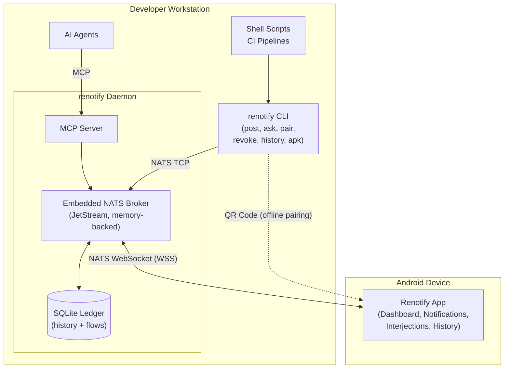

# Renotify Core Architecture — Refinement Plan

This document captures the requirements and implementation plan for building the
initial version of **Renotify**. It provides a structured roadmap covering the
Go CLI, the Android application, and the underlying communications required to
support agent-driven software development workflows.

---

## 1. Context Analysis Summary

Renotify aims to simplify sending notifications to multiple devices,
specifically catering to software development workflows where autonomous agents
or multiple active pipelines need to request user intervention, feedback, or
simply notify the user of state changes.

The system consists of two main components:
1. **Go CLI**: A command-line tool for sending notifications and receiving
   responses. It supports single-shot (fire-and-forget), interactive (wait for
   response), and history (view past events) modes.
2. **Android Application**: The receiving end that displays notifications to the
   user and captures their responses to send back to the originating pipeline.

### 1.1 Concept of Operations (ConOps) [CONOPS-01]
Renotify is designed for developers who employ autonomous agents or long-running
pipelines (e.g., CI/CD builds, data migrations) that occasionally require
asynchronous human intervention or awareness.

In a typical day-to-day operational concept:
* **The Actors:** The system relies on the orchestrated interaction of several
  distinct human and machine components:
  * **The Human Developer:** The primary stakeholder who provisions the
    environment, reviews inbound requests remotely, and issues decisions via
    their mobile device.
  * **The Originating Pipeline / Agent:** The system initiating automated work
    (e.g., CI/CD scripts calling the CLI or AI assistants querying the MCP
    server) that triggers an alert or blocks awaiting human intervention.
  * **The Renotify Daemon:** The local host process that orchestrates routing,
    manages the embedded MCP server, computes timeouts, and transacts all
    permanent historical records to an SQLite ledger.
  * **The NATS Message Broker:** The transport infrastructure (either the
    daemon's embedded server or a shared enterprise node) responsible for
    securing websocket connections and temporarily buffering state via
    JetStream.
  * **The Android Mobile Client:** The smartphone application that maintains a
    persistent background WebSocket connection, renders payloads into native UI
    components, and captures the user's rich interactions.
* **The Context:** The system requires entirely ephemeral execution on the
  sender side (publishing a payload and waiting) combined with a persistent,
  low-overhead background connection on the mobile device.
* **The Life-Cycle Execution:** A developer provisions the local environment by
  running `renotify daemon` (often managed via systemd). From there, two
  distinct workflows are supported:
  * **Traditional CLI Flow:** A shell script or build pipeline uses the
    `renotify ask` command to request input, blocking execution. Once the
    developer provides a decision on their phone (e.g., "Approve/Reject" or
    free-form text), the response routes back to the CLI process, which exits
    with the result, allowing the script to proceed.
  * **Native MCP Flow:** An autonomous AI agent connects to the `renotify
    daemon`'s embedded MCP server. The agent invokes a tool to request input
    natively and suspends execution. The rich response is routed back via the
    MCP protocol without relying on shell command execution.
  * In both flows, if the developer does not respond within the configurable
    timeframe, the request times out and the originating process is informed of
    the failure. All interactions are logged locally for auditability.

### 1.2 Primary Operational Workflows
Derived from the ConOps, the following basic workflows describe how the actors
interact across the system's boundaries. They inform the detailed functional and
technical requirements.

**Workflow 1: Provisioning & Secure Pairing** The developer runs a pairing
command (e.g., `renotify pair`) on their workstation. The CLI calculates
connection details, adjusting for whether the workstation is connecting to a
shared enterprise NATS broker or relying on the local embedded daemon
(discovering its local IP address and generating a self-signed TLS certificate
if necessary). The CLI outputs an ASCII QR code to the terminal. The developer
scans the QR code with the Renotify Android app, which securely provisions
connection parameters (IP, unified port for NATS/MCP, auth token, and specific
certificate pinning data). The app initiates connection attempts and manages
robust reconnection logic moving forward.

**Workflow 2: Ephemeral Fire-and-Forget Notification** An automated script or
agent fires an informational alert. Under the hood, the daemon bridges the
message via its embedded memory-backed JetStream with a relatively short TTL
(minutes to hours). This provides resilience against temporary mobile connection
drops (e.g., switching from WiFi to Cellular) without committing message queues
to the filesystem. When the Android app reconnects, it retrieves any buffered
notifications and renders them natively. Permanent historical logging is
strictly handled by the daemon's local SQLite ledger.

**Workflow 3: Blocking Interactive Prompt** A CI/CD script (via `renotify ask`)
or an AI agent (via MCP) requests critical input with a strict timeout. The
dispatcher blocks execution and waits for feedback. When the developer reviews
the context on their phone and responds (e.g., tapping "Approve"), the rich
result is routed back, unblocking the caller. If the timeout expires before a
response is received, the operation fails fast—signalling an error via a
non-zero UNIX exit code (CLI flow) or an explicit tool error response (MCP
flow).

**Workflow 4: Remote Audit & History Retrieval** To review past notifications on
the mobile device beyond what is actively buffered on the broker, the Android
app executes a standard Core NATS Request-Reply call directed at the daemon. The
daemon queries its underlying SQLite historical ledger and returns the requested
payload, offloading all permanent storage concerns from the broker
infrastructure.

**Workflow 5: Asynchronous Workspace Interjection** A developer monitoring an
actively executing workspace notices an issue, wants to halt operations, or
wishes to leave a specific directive for the pipeline. Without waiting for a
blocking `ask` prompt, the developer proactively issues a "Stop" command or a
free-form interjection from the Android app. This signal is routed via NATS
directly back to the workspace environment, where a listening agent or daemon
intercepts it either to gracefully terminate the pipeline immediately or to
alter its ongoing execution based on the delayed human context.

### 1.3 High-Level Functional Needs
Derived from CONOPS-01:
* **N-01 [Context Transmission]:** The system must ingest, route, and deliver
  structured data.
* **N-02 [Human Interruption]:** The system must present information natively
  and prioritise disruptions.
* **N-03 [Decision Feedback]:** The system must capture rich responses (boolean
  decision, constrained choice, free-form text, or a combination thereof) and
  route them back to the source.
* **N-04 [Lifecycle State]:** The system must handle non-responses (timeouts)
  and log interactions locally for auditability.
* **N-05 [Proactive Interjection]:** The system must allow the human receiver to
  emit asynchronous, unprompted control signals or feedback upstream to
  terminate, pause, or alter the trajectory of active pipelines.

### 1.4 Architectural Considerations
To connect the CLI and the Android app, a reliable transport layer is necessary.
This system will exclusively use NATS as the central message broker,
deliberately excluding alternatives like MQTT or gRPC. NATS serves as the
transport layer across all deployment models, from a solo developer running an
embedded broker at home to a shared enterprise broker serving an entire team.

**Multiplexing & Multi-tenancy** The architecture relies on the NATS subject
namespace to multiplex traffic. Globally unique flow identifiers allow a flat
subject hierarchy (`{username}.flow.{flow_id}.{event_type}`) while structural
context (daemon, workspace) is carried as payload metadata and daemon
heartbeats:
1. **Shared Broker Level:** A single centralised NATS broker can support
   multiple users, each with their own daemons, concurrently. NATS auth scopes
   each user to their own subject prefix.
2. **Daemon Level:** A single user may run daemons on multiple machines. Each
   daemon is distinguished by a persistent `daemon_id` and manages its own set
   of workspaces and flows. The mobile app discovers daemons via periodic
   heartbeat messages.
3. **Flow Level:** Each automation pipeline or agent conversation creates a
   globally unique `flow_id`. Messages are routed by flow_id without encoding
   workspace or daemon in the subject, eliminating namespace collisions.

**High-Level Architecture**

The diagram below shows the major system components and the transport boundaries
between them. On the developer's workstation, shell scripts and AI agents are
the originating callers. Scripts invoke the `renotify` CLI which connects to the
daemon over native NATS TCP; AI agents connect directly to the daemon's embedded
MCP server. The daemon orchestrates all routing, timeout management, and
persistent audit logging through its SQLite ledger. It bridges outbound messages
to the Android mobile client over a NATS WebSocket (WSS) connection secured via
TLS certificate pinning established during the QR pairing flow.

The embedded NATS broker and MCP server are independently toggleable (R-CLI-02,
R-CLI-03). The embedded broker is a first-class deployment model suited to solo
developers working independently or disconnected from enterprise infrastructure.
When the embedded broker is disabled, the daemon connects to an external shared
NATS broker instead. Both models use the same protocol, subject namespace, and
provisioning flow — the mobile app behaves identically regardless of broker
topology.

### 1.5 Key Definitions

The following terms have precise meanings throughout this document and the
implementation. For the complete identifier design, encoding rationale, and
uniqueness analysis, see the [Naming & Addressing
Analysis](analysis-naming-and-addressing.md). All generated identifiers use
Crockford Base32 encoding.

* **Daemon Instance** — A running `renotify daemon` process, identified by a
  persistent `daemon_id` (`dn_` + 13 Base32 characters, 65 bits from UUIDv4).
  Generated on first startup and persisted in the XDG state directory. A user
  may operate daemons on multiple machines; each has a distinct daemon_id.
* **Workspace** — A project directory from which automation pipelines originate.
  Identified by a deterministic `workspace_id` (`ws_` + 16 Base32 characters, 80
  bits from SHA-256 of daemon_id + absolute path). The human-readable display
  name (directory basename, e.g., `renotify`) is NOT unique and is used for UI
  display only.
* **Flow** — A single, time-bounded execution of a pipeline or agent
  conversation within a workspace. Identified by a globally unique `flow_id`
  (`fl_` + 26 Base32 characters, full 128-bit UUIDv7). Flows are ephemeral: they
  begin when a pipeline registers (via `register_flow`) and end when it
  terminates, completes, or is reaped for staleness. A workspace may host many
  concurrent flows. The term "flow" is used instead of "session" to avoid
  ambiguity with MCP protocol sessions, AI agent conversation sessions, and HTTP
  sessions.

The NATS subject hierarchy uses `{username}` and `{flow_id}` for routing (see
R-API-07). Structural context (daemon, workspace) is carried within payloads and
daemon heartbeats, not encoded in the subject. The Android UI groups
notifications by workspace using data from heartbeat messages.

---

## 2. Traceable Requirements

*Note: Attributes such as Originator, Owner, Verification Status, Validation
Status, Priority, Criticality, and Risk are assumed to be "Initial Draft" /
"Standard" for MVP unless explicitly stated otherwise to maintain document
readability.*

### 2.1 Packaging & Integration

#### R-PKG-01: Build Orchestration
**Statement:** The project must use Makefiles as the primary build orchestrator.
The root `Makefile` will delegate to subsystem-specific build tools (e.g., `go
build` for the CLI, Gradle for Android APK creation).
* **Rationale (A1):** Makefiles are universally supported, keep CI/CD pipelines
  simple, and cleanly delegate domain-specific tasks.
* **Trace to Parent (A4):** N-01
* **Allocation (A8):** System-wide Repository
* **V&V Method (A2):** Demonstration

#### R-PKG-02: Single Binary Distribution
**Statement:** The Go CLI binary must be built to contain an embedded copy of
the compiled Android APK assets. The daemon must provide a mechanism to extract
or download the APK for manual installation.
* **Rationale (A1):** Allows the entire system to be distributed as a single
  standalone executable, bypassing the need for a Google Play Store deployment.
  Note: this creates a build-order dependency (Android APK must be compiled
  before the Go binary can embed it). The Makefile should provide a
  `build-cli-dev` target that skips APK embedding for development iteration.
* **Trace to Parent (A4):** N-01
* **Allocation (A8):** Go CLI Application
* **V&V Method (A2):** Demonstration

### 2.2 Domain & API Definitions

#### R-API-01: Notification Payload
**Statement:** Define the core domain model for a notification (e.g., ID, Title,
Body, ResponseTypes[], Priority, SourcePipeline). Notifications may request
multiple response types simultaneously (e.g., boolean with optional text) to
support multi-modal human feedback.
* **Rationale (A1):** Necessary to standardise how agents describe their intent
  to the broker.
* **Trace to Parent (A4):** N-01
* **Allocation (A8):** System-wide
* **V&V Method (A2):** Inspection

#### R-API-02: Response Payload
**Statement:** Define the expected response format from the Android app (e.g.,
NotificationID, Accepted, SelectedAction, FreeFormText, Timestamp). Response
fields are orthogonal: a boolean `Accepted` for yes/no decisions,
`SelectedAction` for constrained choices, and `FreeFormText` for open-ended
input. Multiple fields may be populated simultaneously for multi-modal requests.
* **Rationale (A1):** Allows the agent to receive rich feedback (boolean,
  categorical, or text).
* **Trace to Parent (A4):** N-03
* **Allocation (A8):** System-wide
* **V&V Method (A2):** Inspection

#### R-API-03: Payload Encoding
**Statement:** All message payloads must be encoded in JSON (explicitly
excluding Protobuf).
* **Rationale (A1):** Simplifies integration with various AI agents and
  scripting tools.
* **Trace to Parent (A4):** N-01
* **Allocation (A8):** System-wide
* **V&V Method (A2):** Demonstration

#### R-API-04: Transport Protocol
**Statement:** Remote client connections to NATS (including the Android
application and any client traversing a network boundary) must use WebSockets.
Co-located clients (e.g., CLI commands on the same host as the daemon) may use
native NATS TCP.
* **Rationale (A1):** WebSockets are required where raw TCP may be restricted
  (mobile networks, firewalled environments). Co-located CLI processes benefit
  from native TCP's lower overhead and simpler connection handling.
* **Trace to Parent (A4):** N-01
* **Allocation (A8):** System-wide
* **V&V Method (A2):** Demonstration

#### R-API-05: Global Namespace
**Statement:** The NATS subject hierarchy must use a structured prefix
(`resystems.renotify.>`).
* **Rationale (A1):** Prevents collisions with other organisational traffic on a
  shared broker.
* **Trace to Parent (A4):** N-01
* **Allocation (A8):** System-wide
* **V&V Method (A2):** Inspection

#### R-API-06: Multi-User Support
**Statement:** The subject hierarchy must route at the username level (e.g.,
`resystems.renotify.{username}.>`).
* **Rationale (A1):** Allows multiple developers to share a broker without
  receiving each other's notifications. NATS auth scopes each user to their own
  prefix.
* **Trace to Parent (A4):** N-01
* **Allocation (A8):** System-wide
* **V&V Method (A2):** Demonstration

#### R-API-07: Flow-Based Subject Routing
**Statement:** Routing subject names must use the globally unique `flow_id` as
the primary routing key (e.g.,
`resystems.renotify.{username}.flow.{flow_id}.{event_type}`). Workspace and
daemon context must be carried as payload metadata and daemon heartbeats, not
encoded in the subject hierarchy.
* **Rationale (A1):** Globally unique flow IDs eliminate namespace collisions
  that would arise from embedding workspace names (which collide across users
  and machines) in subjects. The flat hierarchy simplifies NATS ACLs and
  subscription patterns while the mobile UI derives its grouping structure from
  heartbeat data. See the [Naming & Addressing
  Analysis](analysis-naming-and-addressing.md) Section 4 for the full namespace
  design.
* **Trace to Parent (A4):** N-01
* **Allocation (A8):** System-wide
* **V&V Method (A2):** Demonstration

#### R-API-08: Provisioning Schema
**Statement:** Define the minified JSON payload structure to be encoded in the
pairing QR code (containing target IP, port, token, and certificate
fingerprints).
* **Rationale (A1):** A minified JSON payload is more robust over time and
  easier to expand with complex cryptographic parameters than a standard URI
  format. Standardises the secure handshake protocol required for mobile
  connection bootstrapping.
* **Trace to Parent (A4):** N-01
* **Allocation (A8):** System-wide
* **V&V Method (A2):** Inspection

#### R-API-09: Interjection Payload
**Statement:** Define the message structure for an asynchronous control signal
originating from the Android client representing a dynamic human interjection
(e.g., FlowID, Action: "Stop" | "Pause" | "Note", Context).
* **Rationale (A1):** Required to structure proactive steering or termination
  directives.
* **Trace to Parent (A4):** N-05
* **Allocation (A8):** System-wide
* **V&V Method (A2):** Inspection

#### R-API-10: Flow Lifecycle Payload
**Statement:** Define the payload schema for explicitly registering the start
and termination of a distinct pipeline flow (e.g., `FlowID`, `DaemonID`,
`WorkspaceID`, `Status: active|completed|failed`, `Metadata`).
* **Rationale (A1):** Establishes a formal boundary for a workflow, allowing the
  Android UI to easily group and filter notifications by active flows.
* **Trace to Parent (A4):** N-04
* **Allocation (A8):** System-wide
* **V&V Method (A2):** Inspection

#### R-API-11: Error Response Payload
**Statement:** Define a generic error response payload (e.g., CorrelationID,
ErrorCode, Message, Timestamp) for use when any request fails at the daemon or
broker level (e.g., unroutable notification, query failure, rate-limit
rejection).
* **Rationale (A1):** Standardises failure signalling across CLI and mobile
  flows, allowing callers and the Android app to distinguish error categories
  and present meaningful feedback.
* **Trace to Parent (A4):** N-04
* **Allocation (A8):** System-wide
* **V&V Method (A2):** Inspection

### 2.3 Go CLI Application

#### R-CLI-01: Daemon Service
**Statement:** Implement `renotify daemon` to optionally run the embedded NATS
broker (with WebSocket support), the MCP server, or both. Must support
foreground or background detached mode with file logging.
* **Rationale (A1):** Reduces infrastructure overhead by bundling the broker and
  server within the CLI tool.
* **Trace to Parent (A4):** N-01, N-03
* **Allocation (A8):** Go CLI Application
* **V&V Method (A2):** Demonstration

#### R-CLI-02: Embedded NATS Broker Toggle
**Statement:** The daemon must provide an explicit option (e.g., via flag or
config) to enable or disable the embedded NATS broker.
* **Rationale (A1):** Allows the daemon to act exclusively as an MCP server
  connecting to an external centralised NATS broker if preferred.
* **Trace to Parent (A4):** R-CLI-01
* **Allocation (A8):** Go CLI Application
* **V&V Method (A2):** Test

#### R-CLI-03: Embedded MCP Server Toggle
**Statement:** The daemon must provide an explicit option (e.g., via flag or
config) to enable or disable the embedded MCP server.
* **Rationale (A1):** Allows the daemon to operate strictly as a lightweight
  standalone message broker without unnecessarily exposing MCP capabilities.
* **Trace to Parent (A4):** R-CLI-01
* **Allocation (A8):** Go CLI Application
* **V&V Method (A2):** Test

#### R-CLI-04: Single-shot Mode
**Statement:** Implement `renotify post` for fire-and-forget toast
notifications.
* **Rationale (A1):** Supports simple informational alerts that do not require
  human decision.
* **Trace to Parent (A4):** N-01
* **Allocation (A8):** Go CLI Application
* **V&V Method (A2):** Test

#### R-CLI-05: Interactive Mode
**Statement:** Implement `renotify ask` to send a notification with actions and
block until a rich response is received.
* **Rationale (A1):** Enables human-in-the-loop workflows for AI agents.
* **Trace to Parent (A4):** N-03
* **Allocation (A8):** Go CLI Application
* **V&V Method (A2):** Test

#### R-CLI-06: Timeout Management
**Statement:** The interactive mode must support a configurable timeout,
returning a standardised error to the caller if no response is received.
* **Rationale (A1):** Prevents pipelines from hanging indefinitely if the human
  is unavailable.
* **Trace to Parent (A4):** N-04
* **Allocation (A8):** Go CLI Application
* **V&V Method (A2):** Test

#### R-CLI-07: History Mode & Audit Logging
**Statement:** Implement `renotify history` to query and display past
notifications, their resolution states, and rich text responses from a local
SQLite or file-based log.
* **Rationale (A1):** Provides an audit trail for actions reviewed by the human.
* **Trace to Parent (A4):** N-04
* **Allocation (A8):** Go CLI Application
* **V&V Method (A2):** Demonstration

#### R-CLI-08: MCP Server Mode
**Statement:** Implement the Model Context Protocol (MCP), allowing
autonomous agents to invoke `post`, `ask`, `register_flow`,
`refresh_flow`, and `terminate_flow` natively.
* **Rationale (A1):** Standardises agent integration without relying solely on
  shell execution.
* **Trace to Parent (A4):** N-01, N-03
* **Allocation (A8):** Go CLI Application
* **V&V Method (A2):** Demonstration

#### R-CLI-09: Configuration Standard
**Statement:** Store defaults and settings using the XDG Base Directory
specification (e.g., `~/.config/renotify/settings.json`).
* **Rationale (A1):** Conforms to modern Linux desktop standards.
* **Trace to Parent (A4):** N-01
* **Allocation (A8):** Go CLI Application
* **V&V Method (A2):** Inspection

#### R-CLI-10: MCP Agent Notification Pattern
**Statement:** Implement the `notifications/resources/updated` Server-Sent Event
(SSE) pattern within the MCP server to asynchronously notify connected agents
when a user provides decision feedback. The decision must be exposed as a
dynamic resource containing the result (e.g., boolean, message).
* **Rationale (A1):** Enables agents to subscribe to decision outcomes and be
  proactively notified without active polling.
* **Trace to Parent (A4):** R-CLI-08
* **Allocation (A8):** Go CLI Application
* **V&V Method (A2):** Demonstration

#### R-CLI-11: Provisioning Orchestrator
**Statement:** The CLI must mandate a `renotify pair` command that generates
self-signed TLS certificates (if none exist), discovers/overrides network IPs,
and yields an ASCII QR code matching the Provisioning Schema (`R-API-08`) to the
terminal.
* **Rationale (A1):** Establishes the bedrock of secure NATS connectivity
  without requiring manual secret distribution.
* **Trace to Parent (A4):** N-01
* **Allocation (A8):** Go CLI Application
* **V&V Method (A2):** Demonstration

#### R-CLI-12: Ephemeral Message Buffering
**Statement:** When the embedded NATS broker is enabled, the daemon must
configure JetStream exclusively in memory-backed mode and enforce a configurable
message TTL (default: 30 minutes) on active consumers, avoiding filesystem
persistence entirely.
* **Rationale (A1):** Buffers messages to handle temporary mobile drops while
  dodging the operational hazard of bloated local filesystems. The 30-minute
  default balances resilience against brief connectivity interruptions with
  bounded memory consumption.
* **Trace to Parent (A4):** N-04
* **Allocation (A8):** Go CLI Application
* **V&V Method (A2):** Test

#### R-CLI-13: Remote History Provider
**Statement:** The daemon must listen on a reserved Core NATS subject to accept
Request-Reply queries from authenticated clients, serving payload results
directly from the local SQLite historical ledger.
* **Rationale (A1):** Offloads permanent history storage from the broker
  infrastructure while continuing to serve remote auditability constraints.
* **Trace to Parent (A4):** N-04
* **Allocation (A8):** Go CLI Application
* **V&V Method (A2):** Test

#### R-CLI-14: Active Flow Registry & Expiry
**Statement:** The daemon must maintain an active registry of ongoing flows in
SQLite. This registry must support manual termination signals, as well as an
automatic expiry mechanism (marking a flow as idle/stale automatically). The
daemon must expose a Core NATS endpoint to serve the active list and publish
periodic heartbeats containing the structural context (daemon identity,
workspaces, active flow IDs).
* **Rationale (A1):** Offloads complex tracking logic from the Android app,
  providing a single remote source of truth for "what is currently running."
  Heartbeats enable the mobile dashboard to discover daemons and group flows by
  workspace without encoding the hierarchy in NATS subjects.
* **Trace to Parent (A4):** N-04
* **Allocation (A8):** Go CLI Application
* **V&V Method (A2):** Demonstration

#### R-CLI-15: Ephemeral Agent State (Negative Constraint)
**Statement:** The daemon's MCP Server must explicitly *not* expose a tool for
AI agents to fetch or query the notification history ledger. Agents must treat
their interactions with the daemon as strictly ephemeral.
* **Rationale (A1):** Prevents the architectural complexity of agent recovery
  tracking after unexpected crashes, maintaining a resilient, stateless boundary
  for clients.
* **Trace to Parent (A4):** N-04
* **Allocation (A8):** Go CLI Application
* **V&V Method (A2):** Inspection

#### R-CLI-16: Notification Rate Limiting
**Statement:** The daemon must enforce a configurable per-flow notification rate
limit (default: 60 notifications per minute). Notifications exceeding the limit
must be rejected with an ErrorResponse (`R-API-11`).
* **Rationale (A1):** Prevents runaway scripts or misconfigured agents from
  overwhelming the mobile client and broker with unbounded notification volume.
* **Trace to Parent (A4):** N-04
* **Allocation (A8):** Go CLI Application
* **V&V Method (A2):** Test

#### R-CLI-17: Timeout Independence from Mobile Connectivity
**Statement:** The daemon's timeout for a blocking `ask` request must be
computed server-side from the moment the request is received. Mobile client
disconnection and reconnection must not reset or extend the timeout.
* **Rationale (A1):** Guarantees deterministic timeout behaviour for the calling
  pipeline regardless of transient mobile network conditions.
* **Trace to Parent (A4):** N-04
* **Allocation (A8):** Go CLI Application
* **V&V Method (A2):** Test

#### R-CLI-18: Stale Flow Reaping
**Statement:** The daemon must detect flows whose originating CLI process has
terminated (e.g., via heartbeat absence) and automatically mark them as `failed`
in the flow registry within a configurable grace period (default: 5 minutes).
* **Rationale (A1):** Prevents the Android dashboard from displaying phantom
  flows after unexpected pipeline crashes.
* **Trace to Parent (A4):** N-04
* **Allocation (A8):** Go CLI Application
* **V&V Method (A2):** Test

#### R-CLI-19: Hook Dispatcher
**Statement:** Implement `renotify dispatch` as a universal Claude Code hook
handler. The command reads hook event JSON from stdin, discriminates on
`hook_event_name`, and dispatches to the appropriate Renotify flow:
`PermissionRequest` events are forwarded as interactive ask notifications with
boolean response; `Notification` events are forwarded as fire-and-forget post
notifications. Unsupported event types are silently ignored. Non-zero exit on
error ensures graceful fallback to the local terminal prompt.
* **Rationale (A1):** Extends Renotify's reach to agent lifecycle events that
  occur outside the MCP tool loop, enabling remote permission approval and
  status monitoring for unattended agent sessions.
* **Trace to Parent (A4):** N-02, N-03
* **Allocation (A8):** Go CLI Application
* **V&V Method (A2):** Test

### 2.4 Android Application

#### R-MOB-01: Programming Language
**Statement:** The application must be developed using Kotlin rather than Java.
* **Rationale (A1):** Ensures modern, maintainable code utilising coroutines.
* **Trace to Parent (A4):** N-02
* **Allocation (A8):** Android Application
* **V&V Method (A2):** Inspection

#### R-MOB-02: Background Service
**Statement:** Implement a service capable of maintaining a continuous NATS
WebSocket connection to receive messages.
* **Rationale (A1):** Required to asynchronously receive pushed contexts from
  the broker.
* **Trace to Parent (A4):** N-01
* **Allocation (A8):** Android Application
* **V&V Method (A2):** Test

#### R-MOB-03: Presentation & Prioritisation
**Statement:** Handle incoming payloads and display native Android
notifications, differentiating visually between informational and blocking
requests.
* **Rationale (A1):** Prevents alert fatigue and ensures blocking requests
  capture attention.
* **Trace to Parent (A4):** N-02
* **Allocation (A8):** Android Application
* **V&V Method (A2):** Demonstration

#### R-MOB-04: Rich Response Dispatcher
**Statement:** Capture user interaction (boolean buttons, choice selection,
free-form text input, or combinations thereof for multi-modal requests) and
reliably dispatch the specific response payload back via NATS.
* **Rationale (A1):** Closes the loop on the human-in-the-loop workflow with
  contextual feedback.
* **Trace to Parent (A4):** N-03
* **Allocation (A8):** Android Application
* **V&V Method (A2):** Test

#### R-MOB-05: Branding & Cosmetic
**Statement:** Follow the resystems.io branding and incorporate the core SVG
logo within the application UI.
* **Rationale (A1):** Maintains professional consistency with the organisation.
* **Trace to Parent (A4):** N-02
* **Allocation (A8):** Android Application
* **V&V Method (A2):** Inspection

#### R-MOB-06: Secure Pairing Scanner
**Statement:** Implement a camera-based QR scanner pipeline to decode the
pairing payload (`R-API-08`), persisting the target IP, port, token, and
explicitly pinning the designated TLS certificate.
* **Rationale (A1):** Translates the complex terminal handshake into a seamless
  mobile configuration.
* **Trace to Parent (A4):** N-01
* **Allocation (A8):** Android Application
* **V&V Method (A2):** Demonstration

#### R-MOB-07: Remote History Viewer
**Statement:** Provide a Native UI view that requests, receives, and renders the
historical notification ledger from the daemon via a scheduled Core NATS
Request-Reply.
* **Rationale (A1):** Allows developers to conduct historical look-backs native
  to their device, beyond what is currently cached ephemerally in JetStream.
* **Trace to Parent (A4):** N-04
* **Allocation (A8):** Android Application
* **V&V Method (A2):** Demonstration

#### R-MOB-08: Proactive Interjection Interface
**Statement:** Provide an active "Workspace View" UI allowing the human receiver
to actively emit proactive "Stop," "Pause," or free-form context signals
targeting a specific flow.
* **Rationale (A1):** Completes the unprompted loop required for asynchronous
  pipeline tracking and alteration.
* **Trace to Parent (A4):** N-05
* **Allocation (A8):** Android Application
* **V&V Method (A2):** Demonstration

#### R-MOB-09: Active Workspaces Dashboard
**Statement:** Provide a primary Dashboard UI that lists all currently active
workspaces and their constituent flows, querying the daemon's active flow
registry natively over Core NATS Request-Reply and daemon heartbeats.
* **Rationale (A1):** Provides the critical "birds-eye view" of ongoing work,
  grouped by workspace, across all connected daemons.
* **Trace to Parent (A4):** N-02
* **Allocation (A8):** Android Application
* **V&V Method (A2):** Demonstration

#### R-MOB-10: Reconnection UX
**Statement:** When the mobile client loses and re-establishes its WebSocket
connection, any in-flight blocking requests that have not yet timed out
server-side must be re-presented to the user. The app must display a visible
connectivity status indicator at all times.
* **Rationale (A1):** Ensures the developer is aware of connection state and
  does not silently miss time-critical blocking prompts during transient network
  disruptions.
* **Trace to Parent (A4):** N-02
* **Allocation (A8):** Android Application
* **V&V Method (A2):** Demonstration

#### R-MOB-11: Multi-Device Support
**Statement:** The system must support multiple mobile devices paired to the same
daemon simultaneously. Each device receives all notifications independently via
its own JetStream consumer. Device identity is established at pairing time and
carried in the provisioning payload.
* **Rationale (A1):** Developers may use multiple devices (phone + tablet) or
  share a daemon with a colleague for pair programming.
* **Trace to Parent (A4):** N-01, N-02
* **Allocation (A8):** Go CLI Application, Android Application
* **V&V Method (A2):** Test

### 2.5 Security Lifecycle

#### R-SEC-01: Token Revocation
**Statement:** The daemon must support revoking a previously issued pairing
token, immediately terminating the associated mobile WebSocket connection. MVP
implementation: a manual CLI command `renotify revoke`.
* **Rationale (A1):** A lost or compromised mobile device with a valid token
  represents an open credential. Revocation provides the minimum viable response
  to this threat.
* **Trace to Parent (A4):** N-01
* **Allocation (A8):** Go CLI Application
* **V&V Method (A2):** Test

#### R-SEC-02: Per-Device Pairing
**Statement:** Each `renotify pair` invocation generates a unique device identity
and per-device auth token, stored in a device registry (`devices.json`). Multiple
devices may be paired simultaneously (R-MOB-11). Individual devices can be
revoked via `renotify revoke --device <id>` or all devices via `renotify revoke
--all`.
* **Rationale (A1):** Supports multi-device workflows while maintaining per-device
  credential isolation and revocability.
* **Trace to Parent (A4):** R-SEC-01, R-MOB-11
* **Allocation (A8):** Go CLI Application
* **V&V Method (A2):** Test

#### R-SEC-03: Post-MVP Security Deferral
**Statement:** The following security capabilities are explicitly deferred to
post-MVP: fine-grained per-workspace mobile permissions, automatic token
rotation on a scheduled cadence, and multi-device pairing support.
* **Rationale (A1):** Acknowledged security enhancements that exceed the
  complexity budget of the initial release. Documenting them here prevents
  future ambiguity about scope.
* **Trace to Parent (A4):** N-01
* **Allocation (A8):** System-wide
* **V&V Method (A2):** Inspection

### 2.6 MVP Performance Envelope

#### R-SYS-01: MVP Scale Bounds
**Statement:** The system must support at minimum: 20 concurrent active flows,
10 notifications per second aggregate throughput, 10,000 history ledger records,
and a maximum individual payload size of 64 KB.
* **Rationale (A1):** Provides testable lower bounds for MVP validation without
  constraining future scaling. These figures reflect a single-developer
  workstation with moderate automation activity.
* **Trace to Parent (A4):** N-01, N-04
* **Allocation (A8):** System-wide
* **V&V Method (A2):** Test

---

## 3. Implementation Plan

### Phase 1: Architecture & Schemas
*(Goal: Establish the JSON contracts before writing code.)*

- [x] **A-01a: Payload Enumeration:** Enumerate the complete set of required
  payloads mapping domain objects to system workflows.
- [x] **A-01b: Payload Definition:** Define the specific JSON properties and
  structures for all the enumerated messages.
- [x] **A-02: Broker Provisioning & Routing Design:** Define and document the
  NATS subject hierarchy using globally unique flow IDs (e.g.,
  `resystems.renotify.{username}.flow.{flow_id}.{event_type}`). Also document
  the WebSocket connection security (auth, wss:// TLS) and the daemon heartbeat
  subject pattern.
- [x] **A-03: Provisioning & Interjection Schemas:** Document the QR payload
  format and the asynchronous interjection command structure.
- [x] **A-04: Flow State Schemas:** Document the `register_flow` and
  `terminate_flow` payloads.
- [x] **A-05: SQLite Ledger Schema:** Define the table structure,
  columns, indices, and record lifecycle for the daemon's persistent
  SQLite database. Covers the notification history ledger (pairing
  `NotificationRequest` with `NotificationResponse`), the active
  flow registry, and flow lifecycle event storage. Must support the
  `HistoryQueryRequest` filter fields (`workspace_id`, `flow_id`,
  `since`, `until`, `limit`) and the stale reaping query pattern.
- [x] **A-06: Configuration Schema:** Define the unified
  `settings.json` structure under `$XDG_CONFIG_HOME/renotify/`,
  consolidating all configurable parameters (embedded broker
  toggles, listener addresses, JetStream limits, rate limits, grace
  periods, shared broker URL/credentials, heartbeat interval,
  default timeout, log path). Specify defaults, validation rules,
  and the Cobra/Viper binding model.
- [x] **A-07: Notification ID Format:** Specify the `ntf_` identifier
  format, encoding, entropy, generation algorithm, and generator
  location. Add to the identifier summary table in the naming
  analysis.
- [x] **A-08: CLI Contract (Exit Codes & Output Format):** Define the
  exit code mapping from error conditions to numeric codes, and the
  stdout/stderr output format for each CLI command (`post`, `ask`,
  `history`, `pair`, `revoke`). Specify whether output is JSON,
  human-readable, or configurable.
- [x] **A-09: Shared Broker CLI Path:** Document how CLI commands
  connect and authenticate when the daemon uses a shared broker
  instead of the embedded broker. Clarify the internal token
  distribution mechanism for co-located CLI processes.
- [x] **A-10: MCP `post` and `ask` Tool Schemas:** Define the MCP
  tool input/output schemas for `post` and `ask`, including the
  `flow_id` parameter, blocking vs non-blocking semantics for `ask`,
  and the relationship to `DecisionResource` polling.
- [x] **A-11: Interjection Delivery Path:** Document how interjection
  commands reach the originating process (CLI subscription to
  `.interject` subject, MCP interjection notification, "pause"
  operational semantics).
- [x] **A-12: Timeout Enforcement & Delivery:** Clarify the
  authoritative timeout enforcer (daemon vs CLI), how the CLI learns
  about server-side timeout expiry, and whether `ErrorResponse` is
  published on the response subject.
- [x] **A-13: Workspace Discovery:** Document how CLI commands derive
  `workspace_id` from the current working directory, how the daemon
  learns about new workspaces, and fallback behaviour when the CLI
  runs outside a project directory.
- [x] **A-14: History Pagination:** Add `offset` or cursor-based
  pagination to `HistoryQueryRequest` and `HistoryQueryResult`
  schemas.
- [x] **A-15: Payload Version Field:** Add a `"v": 1` version field
  to `ProvisioningPayload` and optionally to other payloads for
  forward-compatible parsing.

### Phase 2: Foundation & Scaffolding
*(Goal: Establish the repositories and environments so cross-compilation targets
exist.)*

- [x] **P-01: Root Build Orchestration:** Create a top-level `Makefile` with
  targets for `build-android`, `build-cli`, and `build-all`.
- [x] **C-01: CLI Scaffolding:** Set up Cobra/Viper commands (with
  XDG-compliant config management) for `daemon`, `post`, `ask`,
  `history`. Ensure `username` is a configurable property.
  Workspace identity is derived from the current working directory
  at runtime (see [Naming &
  Addressing](analysis-naming-and-addressing.md) Section 2.4),
  not from configuration.
- [x] **M-01: App Scaffolding:** Initialise the Kotlin-based Android project
  with necessary permissions (Network, Notifications). *(Crucially, this allows
  a skeleton APK build for later Go embedding).*
- [x] **V-03: Build Verification:** Verify that the CLI and Android applications
  can be built and run.

### Phase 3: Secure Transport & Provisioning
*(Goal: The devices can discover, verify, and talk to each other securely over
WebSockets).*

- [x] **C-02: Daemon Controller:** Implement the daemon orchestrator to run the
  NATS server, the MCP server, or both based on configuration.
- [x] **C-07: Pairing Generator:** Implement `renotify pair` logic, IP
  discovery, TLS cert generation, and ASCII QR output. Use
  [`mdp/qrterminal`][qrterminal] for terminal QR rendering with
  half-block characters at EC level L. See
  [Payload Schemas](analysis-payload-schemas.md) QR Encoding
  Parameters.
- [x] **C-08: JetStream Configuration:** Implement the strict memory-backed and
  TTL setup for embedded NATS.
- [x] **M-06: Secure Pairing Scanner:** Integrate QR code scanning and TLS
  cert pinning for secure connection bootstrapping. Use
  [Google ML Kit Barcode Scanning][mlkit-barcode] for on-device QR
  decoding. See [NATS Transport Design](analysis-nats-transport-design.md)
  Section 5.5 for the `X509TrustManager` fingerprint pinning approach.
- [x] **M-02: NATS Client Service:** Integrate the NATS client into a background
  service to listen for incoming events configured to the pinned user profile.
- [x] **C-12: Token Revocation:** Implement `renotify revoke` to invalidate the
  active pairing token and disconnect the mobile client. Ensure `renotify pair`
  invokes revocation when a prior token exists.
- [x] **C-13: Daemon Heartbeat Publisher:** Implement periodic (30s)
  DaemonHeartbeat publishing on the daemon's heartbeat subject, with immediate
  on-change triggers for flow and workspace state changes.
- [x] **C-14: Config Init & Parameter Help:** Add `renotify config init` to
  generate a template `settings.json` at the XDG config path (minimal by
  default, `--full` for all parameters with defaults), and `renotify config
  list` to print a table of all configurable parameters with key path, type,
  default value, and description. Viper does not provide either capability;
  both require a custom parameter registry.

### Phase 4: Core Operational Workflows
*(Goal: Scripts can successfully execute blocking prompts and wait for human
responses).*

- [x] **C-03: Local Daemon SQLite State:** Implement local SQLite or file-based
  logging of sent notifications and received responses (the ledger foundation).
- [x] **C-04: Single-shot (Post):** Implement payload publishing for simple
  notifications via `renotify post`.
- [x] **C-05: Interactive (Ask):** Implement publish + subscribe-to-response
  with context timeout handling.
- [x] **M-03: Notification Rendering:** Parse incoming payloads and build native
  `NotificationCompat` with pending intents for actions.
- [x] **M-04: Action Response Dispatcher:** Implement logic to catch user
  actions (e.g., via `BroadcastReceiver`) and send the response payload back to
  the originating pipeline.
- [x] **V-00: Integration Smoke Test:** Write an integration smoke test
  exercising the CLI `post` and `ask` round-trip through the embedded NATS
  broker to a mock mobile subscriber. Verify payload serialisation, JetStream
  buffering, and timeout behaviour.

### Phase 5: Agent Layer & State Tracking
*(Goal: Native AI Agent integration via MCP and hooks, real-time asynchronous
workspace monitoring).*

- [x] **C-10: Active Registry Service:** Implement the SQLite-backed flow
  tracker, stale sweeper, and the Core NATS registry presentation endpoint.
- [x] **C-06: MCP Server:** Implement the MCP protocol layer with
  `register_flow`, `refresh_flow`, `terminate_flow`, `post`, and `ask`
  tools plus `DecisionResource` for async decision delivery (R-CLI-08,
  R-CLI-10).
- [x] **C-11: MCP Interjections & Timeouts:** Wire up interjection delivery
  (`InterjectionResource`, daemon-interject consumer) and daemon-side
  timeout enforcement for MCP `ask` requests (D-26, D-27).
- [x] **C-15: Hook Dispatcher Command:** Implement `renotify dispatch` with
  stdin/stdout JSON protocol, PermissionRequest→ask and Notification→post
  mapping, tool input summarisation, and graceful fallback on error. Reuses
  existing `setupFlow`, JetStream publish, and ephemeral consumer
  infrastructure.
- [x] **M-09: Dashboard Rendering:** Implement the Android landing screen
  capable of fetching and displaying the active flow registry list dynamically,
  grouped by workspace using daemon heartbeat data.
- [x] **M-08: Active Workspace UI:** Add the active screen providing proactive
  workspace interruption ("Stop", "Note").

### Phase 6: Auditing & Polish
*(Goal: Historical remote look-backs and finalised native UI assets).*

- [x] **C-09: Daemon Core NATS History API:** Expose the Core NATS endpoint that
  serves data drawn from the SQLite logs. The history query logic is implemented
  in the `ledger` package (C-03). C-09 exposes it via the Core NATS
  `svc.history` endpoint and wires it into `renotify history`.
- [x] **M-07: Remote History Viewer UI:** Develop the ledger overview rendering
  queries pushed over Core NATS Request-Reply.
- [x] **M-05: UI & Branding:** Apply the resystems.io branding and SVG logo to
  the application assets and UI.
- [x] **C-16: Remote Silent Mode:** Implement `renotify silent --device <id>
  on|off` to remotely toggle notification suppression on a paired device. Publishes
  a control message to `resystems.renotify.{username}.device.{device_id}.control`
  via Core NATS. The Android app subscribes to its device control subject and
  updates silent mode state on receipt. No ACL changes needed (daemon publishes,
  mobile subscribes — both already permitted by existing wildcards).

### Phase 7: Final Assembly & Verification
*(Goal: The cohesive single-binary cross-platform distribution).*

- [x] **P-02: Artefact Embedding:** Update the Go CLI tooling to use `go:embed`
  referencing the Android APK via an `internal/embed` package. The `dist/`
  subdirectory is embedded at build time; a `.gitignore` in `dist/` prevents
  APK files from being tracked. Default `go build` succeeds without the APK
  (the embedded FS contains only `.gitignore`); `make` copies the real APK
  into `dist/` before building. The `app` command group (`renotify app apk`)
  nests under a future-extensible parent (for `ios` later).
- [x] **P-03: APK Management Commands:** Implemented as `renotify app apk`
  with two subcommands: `extract` writes the embedded APK to disk, and `serve`
  starts a temporary HTTP server hosting the APK with a QR code containing the
  download URL for easy phone-side installation. Uses `http.ServeContent` for
  Range request support (required by Firefox). Includes ufw hints on Linux.
- [ ] **V-01: End-to-End Tests:** Extend V-00 to cover the full CLI -> real
  Android client -> CLI roundtrip, including pairing, notification rendering,
  and response dispatch.
- [ ] **V-02: Documentation Updates:** Update README with comprehensive setup
  instructions, architecture diagram, and CLI usage examples.

---

## 4. Design Decision Register

The following register records key design decisions with links to the analysis
documents containing the full rationale, alternatives considered, and detailed
specifications.

| ID | Decision Summary | Analysis Document | Date |
|----|-----------------|-------------------|------|
| D-01 | Payload encoding: JSON with snake_case fields, RFC 3339 timestamps, omitempty for optional fields | [Payload Schemas](analysis-payload-schemas.md) | 2026-03-27 |
| D-02 | Payload enumeration: 12 message types across 6 transport mechanisms (JetStream, Pub/Sub, Request-Reply, MCP Resource, Offline QR, contextual) | [Payload Schemas](analysis-payload-schemas.md) | 2026-03-27 |
| D-03 | System element hierarchy: 5-level topology (broker, user, daemon, workspace, flow) with strict containment | [Naming & Addressing](analysis-naming-and-addressing.md) | 2026-03-27 |
| D-04 | Identifier encoding: Crockford Base32 with per-element truncation (flow 128-bit, workspace 80-bit, daemon/device 65-bit) | [Naming & Addressing](analysis-naming-and-addressing.md) | 2026-03-27 |
| D-05 | NATS namespace: flat `{username}.flow.{flow_id}.{event_type}` subjects; structural context in payloads and heartbeats | [Naming & Addressing](analysis-naming-and-addressing.md) | 2026-03-27 |
| D-06 | Terminology: "flow" replaces "session" to avoid ambiguity with MCP, agent, and HTTP sessions | [Naming & Addressing](analysis-naming-and-addressing.md) | 2026-03-27 |
| D-07 | Broker deployment: embedded and shared NATS brokers are equal first-class models; provisioning payload is identical | [Naming & Addressing](analysis-naming-and-addressing.md) | 2026-03-27 |
| D-08 | Payload denormalisation: daemon_id and workspace_id included in every flow payload for self-contained records | [Naming & Addressing](analysis-naming-and-addressing.md) | 2026-03-27 |
| D-09 | Daemon heartbeat: 30s periodic interval with immediate on-change triggers for structural context delivery | [Naming & Addressing](analysis-naming-and-addressing.md) | 2026-03-27 |
| D-10 | JetStream: single `RENOTIFY` stream, memory storage, 30-min MaxAge, 128 MB MaxBytes, Limits retention, Old discard | [NATS Transport](analysis-nats-transport-design.md) | 2026-03-27 |
| D-11 | Consumers: 3 durable (mobile, daemon-lifecycle, daemon-interject) + 1 ephemeral (cli-response); AckExplicit | [NATS Transport](analysis-nats-transport-design.md) | 2026-03-27 |
| D-12 | Listeners: TCP `127.0.0.1:4222` (no TLS, loopback), WSS `0.0.0.0:4223` (TLS required, all interfaces) | [NATS Transport](analysis-nats-transport-design.md) | 2026-03-27 |
| D-13 | TLS: ECDSA P-256, self-signed, 3-year validity, SHA-256 fingerprint, TOFU pinning via QR | [NATS Transport](analysis-nats-transport-design.md) | 2026-03-27 |
| D-14 | Android TLS trust: custom `X509TrustManager` with QR-provisioned fingerprint pinning (TOFU model) | [NATS Transport](analysis-nats-transport-design.md) | 2026-03-27 |
| D-15 | Auth token: `rn_tk_` prefix + 52 Crockford Base32 chars (256-bit entropy); two-account NATS model | [NATS Transport](analysis-nats-transport-design.md) | 2026-03-27 |
| D-16 | ACL: mobile client scoped to response/interject/svc publish only; cannot publish to request/lifecycle/heartbeat | [NATS Transport](analysis-nats-transport-design.md) | 2026-03-27 |
| D-17 | Delivery: JetStream at-least-once within TTL; Core NATS at-most-once; mobile deduplicates on notification `id` | [NATS Transport](analysis-nats-transport-design.md) | 2026-03-27 |
| D-18 | QR generation: `mdp/qrterminal/v3`, EC level L, half-block terminal rendering; scanning: Google ML Kit Barcode | [Payload Schemas](analysis-payload-schemas.md) | 2026-03-27 |
| D-19 | Flow lifecycle: CLI implicit (one flow per command) vs MCP explicit (`register_flow`/`refresh_flow`/`terminate_flow` tools); activity-based reaping timer reset | [Payload Schemas](analysis-payload-schemas.md) | 2026-03-27 |
| D-20 | SQLite ledger: 4 tables (notification_requests, notification_responses, flow_lifecycle_events, active_flows); PRAGMA user_version migration; `INSERT OR IGNORE` dedup; `last_activity_timestamp` for reaping | [SQLite Ledger](analysis-sqlite-ledger.md) | 2026-03-27 |
| D-21 | Configuration: unified `settings.json` under XDG config; Cobra/Viper binding with `RENOTIFY_` env prefix; compiled defaults (no auto-created config file); default ask timeout 5m | [Configuration Schema](analysis-configuration-schema.md) | 2026-03-27 |
| D-22 | Notification ID: `ntf_` + 16 Crockford Base32 chars (80 bits from UUIDv7 truncated); generated by CLI or daemon before NATS publish | [Naming & Addressing](analysis-naming-and-addressing.md), [Payload Schemas](analysis-payload-schemas.md) | 2026-03-27 |
| D-23 | CLI exit codes: 0 success, 1 general, 2 usage, 3 timeout, 4 rate limited, 5 unroutable, 6 not found; `--format json\|text` flag; stdout=data, stderr=diagnostics | [CLI Contract](analysis-cli-contract.md) | 2026-03-27 |
| D-24 | Shared broker CLI path: CLI reads `broker.enabled` from config and branches — embedded uses loopback + internal token, shared uses `shared_broker.url` + configured credentials. Internal token persisted to XDG state (0600). | [NATS Transport](analysis-nats-transport-design.md) | 2026-03-27 |
| D-25 | MCP `post`: fire-and-forget, returns `notification_id`. MCP `ask`: non-blocking, returns `notification_id` + `resource_uri`; agent reads `DecisionResource` asynchronously via `notifications/resources/updated` (R-CLI-10). Daemon fills system fields from flow context. | [Payload Schemas](analysis-payload-schemas.md) | 2026-03-27 |
| D-26 | Interjection delivery: CLI dual-subscribes to `.response` + `.interject`; MCP via `InterjectionResource` at `renotify://interjections/{flow_id}`. `stop` terminates flow (failed). `note` forwarded without state change. `pause` deferred to post-MVP. Debounce 5s per flow+action. | [NATS Transport](analysis-nats-transport-design.md), [Payload Schemas](analysis-payload-schemas.md) | 2026-03-27 |
| D-27 | Timeout: daemon-only enforcement (Model A). Daemon reads `timeout_sec` from `NotificationRequest`, publishes `ErrorResponse` (`code: "timeout"`) on `.response` subject on expiry. CLI has no local timer. MCP agents detect timeout via `DecisionResource` with `decided: true` and absent response fields. | [NATS Transport](analysis-nats-transport-design.md), [CLI Contract](analysis-cli-contract.md) | 2026-03-28 |
| D-28 | Workspace discovery: CLI computes `workspace_id` locally from `daemon_id` + cwd (B1). MCP agents provide `workspace_path` in `register_flow`; daemon computes `workspace_id` (Option B). Workspaces created implicitly on first use. No project-detection heuristic. | [Naming & Addressing](analysis-naming-and-addressing.md), [Payload Schemas](analysis-payload-schemas.md) | 2026-03-28 |
| D-29 | History pagination: offset-based (`offset` + `limit` fields in `HistoryQueryRequest`); safe for append-only ledger. `total` field enables page calculation. | [Payload Schemas](analysis-payload-schemas.md), [SQLite Ledger](analysis-sqlite-ledger.md) | 2026-03-28 |
| D-30 | Payload versioning: `ProvisioningPayload` only (`"v": 1`). Other payloads deferred — they are ephemeral and flow between co-deployed components where version mismatches cannot occur at runtime. | [Payload Schemas](analysis-payload-schemas.md) | 2026-03-28 |
| D-31 | Monorepo layout: `cli/` (Go module `go.resystems.io/renotify`), `clients/android/` (Gradle), `clients/ios/` (future), `lib/make/` (shared .mk includes). `go.mod` in `cli/` not root. APK copied to `cli/embed/` by Makefile before `go:embed`. Standard targets: build, clean, test. | — | 2026-03-28 |
| D-32 | CLI scaffolding: Cobra root + 7 subcommands (daemon, post, ask, history, pair, revoke, apk) with full flag sets. `apk` is a command group with `extract` and `serve` subcommands. Viper config with RENOTIFY_ env prefix and custom Duration decode hook. App struct pattern (explicit config passing, no global state). Exit codes 0-6. | — | 2026-03-28 |
| D-33 | Android scaffolding: Kotlin, namespace `io.resystems.renotify`, compileSdk 36, minSdk 26, Gradle 8.13 wrapper. Permissions: INTERNET, POST_NOTIFICATIONS, CAMERA. APK output: `app-release-unsigned.apk`. | — | 2026-03-29 |
| D-34 | Daemon controller: subsystem interface with `ready chan<- error` close-signalling for ordered startup and reliable testing. `ctx` handles shutdown; `close(ready)` signals success; `ready <- err; close(ready)` signals failure. | — | 2026-03-29 |
| D-35 | MCP transport: SSE on shared loopback HTTP server (`127.0.0.1:4224`), not stdio. Enables concurrent multi-agent access without per-session bridge processes. N agents = N SSE connections to one daemon. | — | 2026-03-29 |
| D-36 | Port architecture: NATS WSS on `0.0.0.0:4223` (TLS, mobile), HTTP on `127.0.0.1:4224` (plain, MCP/dashboard). Separate trust boundaries require separate listeners — NATS needs all-interfaces + self-signed TLS; HTTP needs loopback-only + no TLS. | — | 2026-03-29 |
| D-37 | Crockford Base32: custom implementation (~100 lines, zero dependencies). Go stdlib lacks Crockford variant. Supports `EncodeBits(src, nBits)` for truncated identifiers (daemon_id 65-bit, workspace_id 80-bit) and confusable mapping on decode (I/L→1, O→0). | — | 2026-03-29 |
| D-38 | TLS certificate generation in standalone `tlsgen/` package, separating crypto (ECDSA P-256 key gen, X.509 template, fingerprinting) from state file I/O. Produces in-memory artifacts; caller persists. | — | 2026-03-29 |
| D-39 | IP discovery in `netutil/` package with `PreferredIP` selection: IPv4 private preferred, fallback to any IPv4, then IPv6, then loopback. Independently testable and reusable by future features. | — | 2026-03-29 |
| D-40 | Pairing orchestration in `pairing/` package with injectable `DiscoverIPs` for testability. Command layer stays thin (flag parsing + output formatting). Matches `daemon/controller.go` pattern. | — | 2026-03-29 |
| D-41 | QR testing: automated payload assembly + output shape verification; manual scannability check; no QR decoder test dependency. `mdp/qrterminal` is well-tested upstream. | — | 2026-03-29 |
| D-42 | JetStream setup in `broker/` package (not separate package); uses new `jetstream.New(nc)` API with `CreateOrUpdateStream`/`CreateOrUpdateConsumer` for idempotent startup. Shared broker fallback: verify-only on permission error. All 3 durable consumers created eagerly. | [NATS Transport](analysis-nats-transport-design.md) | 2026-03-29 |
| D-43 | Android QR scanning via Google ML Kit Barcode Scanning (bundled, no Play Services) + CameraX for camera preview. On-device processing, supports all QR versions and EC levels. | [NATS Transport](analysis-nats-transport-design.md) | 2026-03-29 |
| D-44 | TLS fingerprint pinning via custom `X509TrustManager` computing SHA-256 of server cert DER. More restrictive than platform default (trusts exactly one leaf cert vs ~150 CAs). `@SuppressLint("CustomX509TrustManager")` suppresses lint for the non-empty `checkServerTrusted`. | [NATS Transport](analysis-nats-transport-design.md) | 2026-03-29 |
| D-45 | Credential storage via `EncryptedSharedPreferences` (AES-256-GCM via Android Keystore). Interface/implementation split enables mocking in unit tests. | [NATS Transport](analysis-nats-transport-design.md) | 2026-03-29 |
| D-46 | NATS client: jnats (official Java client) over nats.kt/Ktor. Supports WSS, custom SSLContext, username/password auth, JetStream. No Ktor dependency chain. | [NATS Transport](analysis-nats-transport-design.md) | 2026-03-30 |
| D-47 | Android Foreground Service (`FOREGROUND_SERVICE_TYPE_DATA_SYNC`) for persistent NATS connection. Persistent notification satisfies R-MOB-10 (visible connectivity status). | [NATS Transport](analysis-nats-transport-design.md) | 2026-03-30 |
| D-48 | Manual reconnection with exponential backoff (1s, 2s, 4s, 8s, 16s, 30s capped) instead of jnats auto-reconnect. Full TLS + auth + consumer re-bind on each attempt per Section 8.5. | [NATS Transport](analysis-nats-transport-design.md) | 2026-03-30 |
| D-49 | Added `u` (daemon username) field to `ProvisioningPayload` so mobile app can bind to `mobile-{username}` JetStream consumer. Version stays at 1 (app not shipped). | [NATS Transport](analysis-nats-transport-design.md) | 2026-03-30 |
| D-50 | Mobile consumer changed from pull to push with `DeliverSubject: resystems.renotify.{username}.mobile.deliver`. Required because jnats `PushSubscribeOptions.bind()` needs a deliver subject. Subject placed within user namespace to reuse existing subscribe ACL. | [NATS Transport](analysis-nats-transport-design.md) | 2026-03-30 |
| D-51 | Added `$JS.API.CONSUMER.INFO.>` to mobile publish permissions. Required for jnats to look up consumer info when binding a push subscription. Without it, the JetStream API request is silently dropped by the broker, causing a timeout. | [NATS Transport](analysis-nats-transport-design.md) | 2026-03-30 |
| D-52 | Token revocation via file deletion + SIGHUP. `renotify revoke` deletes the pairing token file and signals the daemon. `reloadAuthorization()` automatically disconnects clients whose credentials are no longer valid. No separate client-kick API needed. | [NATS Transport](analysis-nats-transport-design.md) | 2026-03-30 |
| D-53 | Extracted `signalDaemonReload()` as shared helper in `command/signal.go`. Used by both `pair` and `revoke` commands. Returns typed result (sent/no-daemon/failed) so callers print context-appropriate messages. | — | 2026-03-30 |
| D-54 | Heartbeat publisher as daemon `Subsystem`. Publishes an immediate `DaemonHeartbeat` on Start then periodic at configurable interval (default 30s, min 5s). `Publish()` method for on-change triggers. `SetWorkspaces()` for thread-safe snapshot updates. Workspaces empty until flow registry is implemented. | [Payload Schemas](analysis-payload-schemas.md), [NATS Transport](analysis-nats-transport-design.md) | 2026-03-30 |
| D-55 | Heartbeat payload types (`DaemonHeartbeat`, `WorkspaceInfo`) in `heartbeat/` package. Subject pattern `resystems.renotify.{username}.daemon.{daemon_id}.heartbeat`. Core NATS Pub/Sub (not JetStream) — missed heartbeats are superseded by the next one. | [Payload Schemas](analysis-payload-schemas.md) | 2026-03-30 |
| D-56 | Parameter registry (`config.Registry`) as single source of truth for key metadata. Each `ParamInfo` carries key path, type label, env var, description, and `Resolve func(*Config) any`. `setDefaults()` rewritten to iterate the registry instead of hand-written per-key lines, eliminating duplication. Default values come from `Default()` via Resolve. | [Configuration Schema](analysis-configuration-schema.md) | 2026-03-31 |
| D-57 | Hook dispatcher: command hook (`renotify dispatch` via stdio) over HTTP. Reads hook JSON from stdin, discriminates on `hook_event_name`. `PermissionRequest` → `ask` with boolean (Allow/Deny); `Notification` → `post` fire-and-forget. Exit 1 on error for graceful fallback to terminal prompt. Tool input summarised per-tool (Bash→command, Edit/Write/Read→file_path, etc.). Reuses existing `setupFlow` and JetStream infrastructure. | [Hook Integration](analysis-hook-integration.md) | 2026-03-31 |
| D-58 | Schema V2 migration: `display_name TEXT` and `abs_path TEXT` columns added to `active_flows`. Workspace context carried in `FlowLifecycleEvent.Metadata` (keys `workspace_display_name`, `workspace_abs_path`), extracted by daemon lifecycle processor. Wire format unchanged — these are daemon-side enrichment like `username`. | [SQLite Ledger](analysis-sqlite-ledger.md) | 2026-04-01 |
| D-59 | Registry subsystem ordering: ledger → http → mcp → heartbeat → registry. Registry starts after heartbeat so `SetWorkspaces()` + `Publish()` calls find a ready publisher. Registry binds to `daemon-lifecycle-{username}` JetStream consumer via `consumer.Messages()` iterator. Stale reaper runs on 30s ticker aligned with heartbeat interval. | — | 2026-04-01 |
| D-60 | MCP tool scope: C-06 implements all 5 tools (register_flow, refresh_flow, terminate_flow, post, ask) + DecisionResource. C-11 re-scoped to interjection delivery (InterjectionResource, daemon-interject consumer) and daemon-side timeout enforcement (D-27). Avoids implicit-flow workaround and rework. | [Payload Schemas](analysis-payload-schemas.md) | 2026-04-01 |
| D-61 | DecisionStore: in-memory `map[string]*DecisionResource` with `sync.RWMutex`. Created on `ask`, resolved on response arrival, served via MCP resource template `renotify://decisions/{notification_id}`. Response subscriber goroutines tracked in SubscriberMap for cancellation on Stop or terminate_flow. | [Payload Schemas](analysis-payload-schemas.md) | 2026-04-01 |
| D-62 | MCP SDK requires `SubscribeHandler` and `UnsubscribeHandler` in `ServerOptions` for `server.ResourceUpdated()` to deliver notifications. Set to no-op accept-all handlers; SDK manages subscription map internally. | — | 2026-04-01 |
| D-63 | Shared `broker.PublishJSON()` extracted from `command/post.go`. Both CLI commands and MCP server use the same dedup-header JetStream publish pattern. | — | 2026-04-01 |
| D-64 | Workspace metadata constants (`MetaDisplayName`, `MetaAbsPath`) moved from `command` to `payload` package to avoid circular dependency between `command` and `mcpserver`. | — | 2026-04-01 |
| D-65 | InterjectionStore accumulates per flow (queue, not latest-only). `Drain()` returns and clears all. `check_interjections` (non-blocking) and `await_interjection` (blocking with timeout) consume the queue. Mirrors DecisionStore channel pattern for event-driven wake. | [Payload Schemas](analysis-payload-schemas.md) | 2026-04-01 |
| D-66 | Interjection consumer lives in `mcpserver` (not `registry`) — its primary job is MCP agent delivery. Debounce via in-memory map keyed by `flow_id:action`, configurable window (default 5s). `pause` treated as `note` for MVP. | [NATS Transport](analysis-nats-transport-design.md) | 2026-04-01 |
| D-67 | Daemon-side timeout: goroutine per ask, `select` on `time.After(timeoutSec)` vs `DecisionStore.Resolved` channel. On timeout: publishes `ErrorResponse(code:"timeout")` to `.response` subject. Response subscriber resolves DecisionResource with decided=true, no response fields. | [NATS Transport](analysis-nats-transport-design.md) | 2026-04-01 |
| D-68 | Multi-device pairing: per-device `device_id` (`mb_` + 13 Crockford Base32), per-device auth token, per-device NATS account (`mobile-{device_id}`), per-device JetStream push consumer (`mobile-{username}-{device_id}`). Device registry stored in `devices.json`. Provisioning payload v2 adds `"d"` (device_id) and `"n"` (NATS username). Legacy v1 single-token migrated on daemon startup. Daemon creates consumers at startup from registry; SIGHUP reloads auth from registry. R-SEC-02 updated from single-device to multi-device model. | [NATS Transport](analysis-nats-transport-design.md) | 2026-04-02 |
| D-69 | Heartbeat payload extended: `WorkspaceInfo.ActiveFlows` changed from `[]string` (flow IDs only) to `[]FlowInfo` carrying `flow_id`, `label`, and `metadata` per flow. Dashboard renders label prominently with metadata key-value pairs below. Live updates on `refresh_flow` — heartbeat already fires on flow lifecycle changes via `rebuildWorkspaceSnapshot()`. | [Payload Schemas](analysis-payload-schemas.md) | 2026-04-02 |

---

## 5. Change Log

Record completed items here with the date.

| Date | Item | Notes |
|------|------|-------|
| 2026-03-26 | A-01a | Enumerated payload schemas across all workflows and revised R-API-08 for minified JSON QR codes. |
| 2026-03-26 | Review | Document-wide refinement: added Section 1.5 (Key Definitions), Section 2.5 (Security Lifecycle), Section 2.6 (MVP Performance Envelope); new requirements R-API-11, R-CLI-16/17/18, R-MOB-10, R-SEC-01/02/03, R-SYS-01; revised R-API-04, R-API-07, R-CLI-12; added V-00 integration checkpoint, C-12 token revocation; structural fixes. |
| 2026-03-26 | A-01a | Split payload table "Direction / Transport" into separate Transport and Direction columns with a closed taxonomy of transport labels. |
| 2026-03-27 | A-01b | Defined Go structs and JSON exemplars for all 11 payload schemas with shared enumeration types. |
| 2026-03-27 | Harmonisation | Renamed "session" to "flow" throughout. Introduced daemon_id, workspace_id, and Crockford Base32 identifiers per naming analysis. Simplified NATS namespace to flat flow-based subjects. Added DaemonHeartbeat payload. Extracted payload schemas into standalone analysis document. Restructured Section 4 as Design Decision Register. |
| 2026-03-27 | A-02 | NATS transport and subject design analysis. Subject catalogue (7 subjects), JetStream stream and consumer configuration, delivery guarantees and idempotency analysis, listener configuration (TCP 4222 + WSS 4223), TLS certificate spec (ECDSA P-256) with Android trust bootstrap analysis (TOFU fingerprint pinning), auth token design (256-bit Crockford Base32), two-account ACL model, connection lifecycle sequences, deployment model comparison. Updated ProvisioningPayload example (port 4223, full-length token). |
| 2026-03-27 | A-03 | Provisioning and interjection schemas confirmed complete. Added QR encoding parameters (mdp/qrterminal/v3, EC level L, half-block rendering, capacity analysis). Added ML Kit recommendation for Android QR scanning. Updated C-07 and M-06 with library references. Multi-modal response types and boolean accepted field added to NotificationResponse and DecisionResource. |
| 2026-03-27 | A-04 | Flow lifecycle management documented. Defined two paths: CLI implicit (one flow per command) and MCP explicit (agent-managed via `register_flow`/`refresh_flow`/`terminate_flow` tools). Added MCP tool input/output schemas with Go structs, JSON exemplars, and error conditions. Activity-based reaping timer reset on any tool call referencing a flow. `refresh_flow` enables progress updates on long-running MCP flows. Future `status` field noted for transient progress messages. |
| 2026-03-27 | Gap analysis | Phase 1 gap analysis identified 15 items. Added A-05 (SQLite ledger schema), A-06 (configuration schema), and A-07 through A-15 covering notification ID format, CLI contracts, shared broker path, MCP post/ask tools, interjection delivery, timeout enforcement, workspace discovery, history pagination, and payload versioning. |
| 2026-03-27 | A-05 | SQLite ledger schema defined in standalone analysis document. Four tables: notification_requests, notification_responses (1:0..1 join), flow_lifecycle_events (append-only audit), active_flows (hot working set with last_activity_timestamp). PRAGMA user_version migration strategy with idempotent DDL. Query patterns for history, active flows, stale reaping, rate limiting, and deduplication. Complete V1 migration script. |
| 2026-03-27 | A-06 | Unified configuration schema in standalone analysis document. XDG directory layout (config vs state), Go struct definitions with JSON tags and defaults, two example settings.json (embedded and shared broker), Viper binding model with RENOTIFY_ env prefix and CLI flag mapping, validation rules per parameter. Default ask timeout set to 5 minutes. Cobra and Viper added to references. |
| 2026-03-27 | A-07 | Notification ID format specified: `ntf_` + 16 Crockford Base32 chars (80 bits from UUIDv7 truncated). Added to identifier summary table in naming analysis. Updated all payload schema exemplars with correct-length IDs. |
| 2026-03-27 | A-08 | CLI output contract in standalone analysis document. Exit codes 0-6 mapped to ErrorResponse codes. Output routing: stdout=data, stderr=diagnostics. Per-command output specs with JSON exemplars for ask, history, post, pair, revoke. `--format json|text` flag with per-command defaults. Shell script integration examples. |
| 2026-03-27 | A-09 | Shared broker CLI path documented. CLI branches on `broker.enabled`: embedded mode uses loopback TCP + internal token from XDG state, shared mode uses `shared_broker.url` + configured credentials. Internal token persisted to `$XDG_STATE_HOME/renotify/internal_token` (0600), generated once on first daemon startup. Section 8.6 split into embedded/shared subsections. Deployment comparison table updated with CLI connection rows. |
| 2026-03-27 | A-10 | MCP `post` and `ask` tool schemas defined. `post` is fire-and-forget, returns notification_id. `ask` is non-blocking, returns notification_id + resource_uri; agent reads DecisionResource asynchronously via notifications/resources/updated (R-CLI-10). Daemon fills system fields (id, daemon_id, workspace_id, timestamp) from flow context. Timeout detection via DecisionResource with decided:true but absent response fields. Operations comparison table updated. |
| 2026-03-27 | A-11 | Interjection delivery path fully specified. CLI dual-subscribes to `.response` + `.interject` during `ask` wait. Daemon processes interjections: `stop` terminates flow (publishes FlowLifecycleEvent failed), `note` forwards context without state change, `pause` deferred to post-MVP (treated as note). MCP delivery via new `InterjectionResource` at `renotify://interjections/{flow_id}`. Debounce: 5s per flow+action, configurable via `interjection.debounce_window`. New `interjections` SQLite table added to V1 migration. |
| 2026-03-28 | A-12 | Timeout enforcement resolved: daemon-only model (Model A). Daemon reads `timeout_sec` from `NotificationRequest` payload and is the sole timer enforcer (R-CLI-17). On expiry daemon publishes `ErrorResponse` (`code: "timeout"`) on `.response` subject — CLI receives it directly, no local timer needed. Resolved contradictions in Sections 3.3, 8.6, 8.8 of transport design. Updated CLI contract and payload schemas with enforcement clarification. |
| 2026-03-28 | A-13 | Workspace discovery documented. CLI computes workspace_id locally from daemon_id + cwd (B1 model). MCP agents provide workspace_path in register_flow; daemon computes workspace_id and returns it (Option B). RegisterFlowRequest changed from workspace_id to workspace_path; RegisterFlowResult now includes workspace_id. Workspaces created implicitly on first use. No project-detection heuristic. Updated naming analysis Section 2.4, transport design Section 8.6, and C-01 description. |
| 2026-03-28 | A-14 | Added `offset` field to `HistoryQueryRequest` for offset-based pagination. Updated SQLite history query with `OFFSET :offset`. Added `--offset` CLI flag to `renotify history`. |
| 2026-03-28 | A-15 | Added `"v": 1` version field to `ProvisioningPayload` only. Other payloads deferred — they are ephemeral and flow between co-deployed components. ProvisioningPayload is uniquely at risk because it persists in the mobile app's local storage across daemon upgrades. |
| 2026-03-28 | P-01 | Root build orchestration implemented. Monorepo layout: `cli/` (Go, `go.resystems.io/renotify`), `clients/android/` (Gradle), `clients/ios/` (future placeholder), `lib/make/` (shared common.mk, go.mk, gradle.mk). Chained Makefiles with standard targets (build, clean, test). `go.mod` in `cli/` for polyglot separation; APK copied to `cli/embed/` by root Makefile. `build-cli-dev` target for fast Go iteration without APK. |
| 2026-03-28 | C-01 | CLI scaffolding implemented. Cobra root command + 7 subcommands (daemon, post, ask, history, pair, revoke, apk) with full flag sets. `apk` is a command group with `extract` and `serve` subcommands. Viper config loading with RENOTIFY_ env prefix, settings.json file, and compiled defaults. Custom Duration type with mapstructure decode hook. Config validation (all constraints from A-06). XDG path resolution. Exit code constants 0-6. App struct pattern for explicit config passing. |
| 2026-03-29 | M-01 | Android project scaffolding. Kotlin, namespace `io.resystems.renotify`, compileSdk 36, minSdk 26, targetSdk 36, buildToolsVersion 36.1.0. Gradle 8.13 wrapper. Permissions: INTERNET, POST_NOTIFICATIONS, CAMERA. Stub MainActivity. Makefile auto-generates local.properties from ANDROID_HOME. Root Makefile updated for unsigned APK filename. |
| 2026-03-29 | V-03 | Build verification passed. CLI: `make build-dev` produces 8.1 MB binary, 18 tests pass, `go vet` clean. Android: `assembleRelease` produces 1.8 MB unsigned APK. Full chain: `make build-all` builds Android then CLI with APK copy to `cli/embed/`. `make clean` removes all artifacts. |
| 2026-03-29 | C-02 | Daemon controller implemented. Embedded NATS server (TCP 4222 + WSS 4223) with JetStream enabled, two-account auth (daemon + mobile ACLs), shared broker connection path. State management: daemon_id (`dn_` + 13 Crockford Base32), internal token (`rn_tk_` + 52 chars), pairing token loading. Subsystem interface with `ready chan<- error` close-signalling for ordered startup. Shared loopback HTTP server (`127.0.0.1:4224`, plain HTTP) with MCP SSE at `/mcp`. Signal handling (SIGINT/SIGTERM), foreground/background logging modes. New packages: `crockford`, `state`, `broker`, `httpserver`, `mcpserver`, `daemon`. Dependencies: nats-server v2.12.6, nats.go v1.50.0, go-sdk v1.4.1. MCPConfig expanded with `host`/`port` fields. 65 tests (unit + integration). |
| 2026-03-29 | C-07 | Pairing generator implemented. ECDSA P-256 self-signed certificate generation (3-year validity, daemon_id in CN, all discovered IPs + localhost in SANs). Local IP discovery (non-loopback, non-link-local) with IPv4 private preference. Pairing token management (always-new `rn_tk_` token, overwrites prior). ProvisioningPayload assembly with single-char JSON keys (`v`, `h`, `p`, `t`, `c`). ASCII QR rendering via `mdp/qrterminal` half-block at EC level L. Text and JSON output formats. `--ip` override, `--regenerate-cert` flag. Certificate fingerprint: SHA-256 of DER, hex-encoded (64 chars). New packages: `tlsgen`, `netutil`, `pairing`. Extended `state/` with `WriteTLS` (0644/0600), `GenerateToken`, `WriteUsername`. Dependency: qrterminal/v3. 64 tests (unit + integration). |
| 2026-03-29 | C-08 | JetStream configuration implemented. RENOTIFY stream created at daemon startup with memory storage, limits retention, discard old, 1 replica, and configurable age/bytes/msg-size/msgs-per-subj/dup-window from JetStreamConfig. Three durable consumers created: `mobile-{username}` (AckExplicit, MaxDeliver=3, MaxAckPending=256, InactiveThreshold=35m), `daemon-lifecycle-{username}` and `daemon-interject-{username}` (MaxAckPending=64, InactiveThreshold=5m). Uses new `jetstream.New(nc)` API with idempotent `CreateOrUpdateStream`/`CreateOrUpdateConsumer`. Shared broker permission fallback (verify-only on 403). Fixed WSS TLS to use direct `TLSConfig` instead of `TLSMap`. 13 new tests (config builders + publish/consume + isolation). |
| 2026-03-29 | M-06 | Secure pairing scanner implemented. QR scanning via Google ML Kit Barcode Scanning (bundled) + CameraX preview with `ImageAnalysis` frame processing. `ProvisioningPayload` data class with `fromJson` parsing and strict validation (version, host, port, Crockford Base32 token format, lowercase hex fingerprint). Custom `FingerprintTrustManager` (`X509TrustManager`) computes SHA-256 of server cert DER for fingerprint pinning (Section 5.5 Approach A). `PinnedSSLContext` factory creates `SSLContext` for M-02's NATS WSS connection. `EncryptedProvisioningStore` using `EncryptedSharedPreferences` (AES-256-GCM via Android Keystore). `ScannerActivity` with CameraX + ML Kit + runtime permission handling. `MainActivity` updated with pair button and status display. Dependencies: CameraX 1.4.2, ML Kit barcode-scanning 17.3.0, security-crypto 1.1.0-alpha06. Test infrastructure: JUnit 4.13.2, org.json 20240303 (JVM), AndroidJUnit4 (instrumented). 46 JVM unit tests + 7 instrumented tests. |
| 2026-03-30 | M-02 | NATS client service implemented. Added `u` (daemon username) field to `ProvisioningPayload` on both Go and Android sides for JetStream consumer binding. Android Foreground Service (`NatsService`) with persistent notification showing connection state (R-MOB-10). `NatsConnectionManager` with coroutine-driven connect/reconnect and exponential backoff (1s-30s capped, Section 8.5). `NatsOptionsBuilder` builds jnats `Options` from provisioning credentials (WSS URL, `PinnedSSLContext`, `userInfo("mobile", token)`, `noReconnect()`). `ConnectionState` sealed class with `StateFlow` for UI observation. Binds to pre-existing `mobile-{username}` durable JetStream consumer (created by C-08). Dependencies: jnats 2.21.1, kotlinx-coroutines-android 1.10.1, lifecycle-runtime-ktx/lifecycle-service 2.9.0. Clarified Section 6.4 of transport design doc with literal NATS usernames. Updated device-testing.md with firewall, emulator networking (10.0.2.2), and NATS troubleshooting. 16 JVM unit tests (options builder, backoff, state, username). |
| 2026-03-30 | C-12 | Token revocation implemented. `renotify revoke` deletes the pairing token and username files from XDG state and sends SIGHUP to the running daemon. The daemon's `reloadAuthorization()` automatically disconnects clients whose credentials are no longer valid — no separate client-kick API needed. Shared broker mode deletes local token and warns operator must revoke on broker side. Idempotent: reports "no active pairing" when no token exists. Text and JSON output formats. Extracted `signalDaemonReload()` as shared helper in `command/signal.go` (used by both `pair` and `revoke`). Updated `pair` long description to reflect SIGHUP hot-reload (no longer says "daemon must be restarted"). R-SEC-02 already satisfied: `renotify pair` overwrites prior token + SIGHUP disconnects old client. 8 new tests (state deletion + command). |
| 2026-03-30 | C-13 | Daemon heartbeat publisher implemented. New `heartbeat/` package with `DaemonHeartbeat` and `WorkspaceInfo` payload types matching the analysis schema. `Publisher` implements `daemon.Subsystem`: publishes an immediate heartbeat on Start (Section 8.1 step 12), then periodic at configurable interval (default 30s). `Publish()` for on-change triggers, `SetWorkspaces()` for thread-safe snapshot updates. Workspaces array is empty until the flow registry is implemented (C-03/C-04/C-05). Subject: `resystems.renotify.{username}.daemon.{daemon_id}.heartbeat` via Core NATS Pub/Sub (ephemeral, not JetStream). `daemon_id` loaded in `runDaemon()` before controller startup for publisher construction. 8 new tests (subject, payload serialisation, empty workspaces, immediate/periodic publish, stop, workspace update). |
| 2026-03-31 | C-14 | Config init and parameter help implemented. New `config.Registry` (`[]ParamInfo`) as single source of truth for key metadata — carries key path, type label, env var, description, and `Resolve func(*Config) any`. Refactored `setDefaults()` from 30 hand-written lines to a 6-line loop iterating the registry, eliminating duplication between Viper key registration and the parameter catalogue. `renotify config init` generates `settings.json` (minimal with username only, or `--full` with all defaults; `--force` to overwrite; `--output` for custom path). `renotify config list` prints tabwriter table of all 27 parameters (key, type, default, env var, description); `--format json` for machine-readable output. `config` parent command overrides `PersistentPreRunE` to skip config loading so commands work without existing settings.json. 12 new tests (5 registry, 7 command). |
| 2026-03-31 | C-03 | Local daemon SQLite state implemented. New `payload/` package for shared wire-format types (`NotificationRequest`, `NotificationResponse`, `FlowLifecycleEvent`, `InterjectionCommand`, `ErrorResponse`) with typed enums (`ResponseType`, `Priority`, `FlowStatus`, `InterjectionAction`) matching analysis-payload-schemas.md. New `ledger/` package using `modernc.org/sqlite` (pure Go, CGo-free). Five tables with 9 indices; `username TEXT NOT NULL` on 4 record-originating tables for future history aggregation. Ledger accepts payload types for persistence; daemon-side enrichment (username) passed via `WriteContext` struct, keeping wire-format types clean. `ActiveFlow` is a ledger-only storage type (not a wire format). Schema V1 DDL in embedded `schema_v1.sql`. PRAGMA `user_version`-based migration, WAL mode, foreign keys, busy timeout. Full CRUD: INSERT OR IGNORE dedup, transactional flow registration/refresh/termination, stale reaping query, rate-limiting count, LEFT JOIN history query with filters and pagination. Ledger implements `daemon.Subsystem` (registered first). `renotify history` CLI wiring deferred to C-09 (Phase 6). 42 ledger tests. |
| 2026-03-31 | C-04 | Single-shot post implemented. `renotify post` connects to the daemon's NATS broker (embedded or shared via `broker.ConnectCLI`), generates identifiers (`flow_id`, `notification_id`, `workspace_id`), publishes a transient flow lifecycle (active → completed) and a `NotificationRequest` with `response_types: ["none"]` to JetStream with `Nats-Msg-Id` deduplication header. New `state/workspace.go` (deterministic `WorkspaceID` from SHA-256 of daemon_id + cwd), `state/flowid.go` (UUIDv7-based `GenerateFlowID` and `GenerateNotificationID`), `broker/subjects.go` (NATS subject helpers), `broker.ConnectCLI` (shared CLI-to-NATS connection for post/ask/history). Text output is silent (exit 0); JSON output returns `{"status":"sent","notification_id":"..."}`. Rate limiting and unroutable detection deferred to daemon-side processing. Integration test with embedded NATS server verifies end-to-end publish. 7 new tests. |
| 2026-03-31 | C-05 | Interactive ask implemented. `renotify ask` publishes a `NotificationRequest` with `timeout_sec` and user-specified `response_types`/`actions`, creates two ephemeral JetStream consumers (`.response` and `.interject`) using the new `natsjs` API, and blocks until a response arrives. Discriminates `NotificationResponse` from `ErrorResponse` on the `.response` subject via `code` field probe. Handles interjections: `stop` → exit 1 with failed lifecycle, `note` → print to stderr and continue waiting. CLI safety timeout (`timeout_sec + ask_grace_period`) protects against daemon failure. New `config.Timeout.AskGracePeriod` (default 30s) configurable via `settings.json`. Shared flow setup extracted to `command/flow.go` (`setupFlow`/`flowContext`), used by both `post` and `ask`. Short flags: `-t`/`-b`/`-r`/`-a`. Text format: `Response: Yes/No/Action`, `Comment: ...`. JSON format: raw `NotificationResponse`. Signal handling (Ctrl-C) publishes failed lifecycle before exit. 10 new ask tests + config registry updated to 28 entries. |
| 2026-03-31 | — | `renotify answer` utility implemented. Publishes a `NotificationResponse` to unblock a waiting `renotify ask`. Takes `--flow-id` (`-f`) and `--request-id` (`-n`) from ask's stderr output. Response flags: `--accepted`/`--rejected` (mutually exclusive), `--action` (`-a`), `--text` (`-t`, reads stdin). Lightweight: connects, publishes one JetStream message with dedup header, exits. No flow lifecycle events (owned by ask). `ask` updated to print identifiers to stderr (`Waiting for response (flow=..., notification=...)`). Enables end-to-end ask/answer testing without mobile app. 8 new tests. |
| 2026-03-31 | — | `renotify interject` utility implemented. Publishes an `InterjectionCommand` (`stop`, `pause`, `note`) to a running flow's `.interject` subject. Action is a positional argument; takes `--flow-id` (`-f`) and optional `--context` (`-c`, reads stdin). Dedup header uses flow_id + action + timestamp to distinguish successive interjections. Completes the CLI testing toolkit: post → ask → answer/interject. 7 new tests. |
| 2026-03-31 | M-03 | Notification rendering implemented. New `notification/` package: `NotificationPayload` data class parses incoming `NotificationRequest` JSON, `NotificationRenderer` builds and posts native `NotificationCompat` notifications. Renders both fire-and-forget (post, dismissible, no buttons) and interactive (ask, ongoing, with action buttons). Priority differentiation: high → heads-up via `renotify_urgent` channel (IMPORTANCE_HIGH), normal/low → `renotify_notifications` channel (IMPORTANCE_DEFAULT). Action buttons per response type: boolean (Yes/No), choice (per-label), text (RemoteInput inline reply), multi-modal (combination). Android 3-button limit enforced: overflow shows first 2 + "More..." button. PendingIntents carry notification_id/flow_id/action_type extras for M-04 BroadcastReceiver. `NatsConnectionManager` updated: message callback via coroutine pump with `nextMessage()`, dedup set for reconnect redelivery. `NatsService` wires message handler with subject discrimination (`.request` → render, `.lifecycle` completed/failed → dismiss). 14 new JVM tests (payload parsing, channel selection, notification ID determinism). R-MOB-03 satisfied. |
| 2026-03-31 | M-04 | Action response dispatcher implemented. `NotificationActionReceiver` BroadcastReceiver catches notification action button taps, extracts intent extras (notification_id, flow_id, action_type, action_value), and delegates publishing to `NatsService` via `startService` with `ACTION_PUBLISH_RESPONSE`. Service builds `NotificationResponse` JSON (`buildResponseJson` — static, testable), publishes to `.response` JetStream subject with dedup header, and dismisses the notification. Handles boolean (accepted/rejected), choice (action label), text (RemoteInput extraction), and "More..." (opens app). Registered in AndroidManifest.xml. R-MOB-04 satisfied. 6 new JVM tests. |
| 2026-03-31 | V-00 | Integration smoke tests implemented. 7 scenarios in `smoke_test.go`: post round-trip (payload fields, lifecycle events), ask with mock response (full round-trip), ask + answer utility (CLI-to-CLI), ask + interject stop, JetStream buffering (publish before subscriber connects, delivered via durable consumer), safety timeout (exit code 3), and payload serialisation (snake_case keys, omitempty, RFC 3339 timestamps). Mock mobile subscriber uses `broker.EnsureJetStream` to create durable consumers. Verifies R-CLI-04, R-CLI-05, R-API-01, R-API-02, R-CLI-12. Phase 4 complete. |
| 2026-03-31 | A-16 | Claude Code hook integration analysis. Mapped `PermissionRequest` hook event to `renotify ask` (boolean Allow/Deny) and `Notification` hook event to `renotify post` (fire-and-forget). Evaluated command (stdio) vs HTTP transport — command preferred for graceful fallback (exit 1 → terminal prompt), no daemon dependency, and negligible latency overhead vs human response time. Designed `renotify dispatch` as universal hook handler: reads JSON from stdin, discriminates on `hook_event_name`, composes notifications from tool-specific input summarisation. New requirement R-CLI-19, implementation item C-15. |
| 2026-04-01 | C-10 | Active registry service implemented. New `registry/` package as daemon subsystem: lifecycle consumer binds to `daemon-lifecycle-{username}` JetStream consumer via `consumer.Messages()` iterator, processes `FlowLifecycleEvent` messages (active→register, completed/failed→terminate), updates SQLite active_flows table. Stale reaper goroutine (30s ticker) calls `ReapStaleFlows()` and publishes `failed` lifecycle events for expired flows. `svc.flows` Core NATS Request-Reply endpoint serves `ActiveFlowsQuery`/`ActiveFlowsResult`. Workspace snapshot builder groups active flows by workspace_id, feeds `heartbeat.Publisher.SetWorkspaces()` + immediate publish on every state change. Schema V2 migration adds `display_name` and `abs_path` columns to `active_flows`. CLI lifecycle events include workspace metadata (`workspace_display_name`, `workspace_abs_path`) in `FlowLifecycleEvent.Metadata`. Subsystem ordering: ledger → http → mcp → heartbeat → registry. R-CLI-14, R-CLI-18 satisfied. 6 new registry tests, all existing tests pass. |
| 2026-04-01 | C-06 | MCP server implemented with all 5 tools and DecisionResource. `register_flow` generates flow_id + workspace_id, registers in ledger, publishes lifecycle event. `refresh_flow` updates label/metadata, resets reaping timer. `terminate_flow` removes flow, publishes terminal lifecycle event. `post` sends fire-and-forget notification to mobile. `ask` sends interactive notification, creates pending `DecisionResource`, starts response subscriber goroutine; on mobile response, resolves resource and emits `notifications/resources/updated` via MCP SDK. DecisionStore: in-memory thread-safe map served via resource template `renotify://decisions/{notification_id}`. Shared `broker.PublishJSON()` extracted from CLI commands. Workspace metadata constants moved to `payload` package. MCP SDK `SubscribeHandler`/`UnsubscribeHandler` configured for resource subscriptions. C-11 re-scoped to interjections + timeout enforcement. Tool descriptions written as agent instructions per project memory. Manual testing playbook in `cli/docs/mcp-testing.md`. R-CLI-08, R-CLI-10, R-CLI-15 satisfied. 17 new tests (5 server, 6 DecisionStore, 4 integration, 2 subscriber). |
| 2026-04-01 | C-11 | MCP interjections and timeouts implemented. New `InterjectionStore` accumulates interjections per flow with queue + notification channel. Interjection consumer binds to `daemon-interject-{username}` JetStream consumer, debounces per flow+action (5s window), dispatches: `stop` → publish failed lifecycle + resolve pending decisions; `note` → update store + emit resource notification; `pause` → treat as note. Two new tools: `check_interjections` (non-blocking drain) and `await_interjection` (blocking with timeout). `InterjectionResource` template at `renotify://interjections/{flow_id}`. Daemon-side timeout timer per `ask`: goroutine selects on timeout vs DecisionStore.Resolved channel, publishes `ErrorResponse(code:"timeout")` on `.response` on expiry. `InterjectionResource` payload type added. R-CLI-08, R-CLI-17, R-API-09 satisfied. |
| 2026-04-01 | C-15 | Hook dispatcher command implemented. `renotify dispatch` reads Claude Code hook JSON from stdin, discriminates on `hook_event_name`. `PermissionRequest` → interactive `ask` with boolean Allow/Deny response, blocks until mobile user responds, writes hook decision JSON to stdout. `Notification` → fire-and-forget `post`, exits immediately. Unsupported events → silent no-op (exit 0). Exit 1 on error for graceful fallback to terminal prompt. Tool input summarisation extracts human-readable body per tool (Bash→command, Edit/Write/Read→file_path, Glob→pattern in path, Grep→/pattern/ in path, Agent→type: description, WebFetch→url, WebSearch→query, MCP→tool name, fallback→compact JSON truncated to 200 chars). Source field: `claude-code/{session_id}`. Refactored `setupFlow` into `setupFlowFromDir` for hook's cwd. Testing playbook in `cli/docs/hooks-testing.md`. R-CLI-19 satisfied. 23 new tests (13 summarisation, 2 source, 3 command-level, 5 integration). |
| 2026-04-01 | M-09 | Dashboard rendering implemented. Android app subscribes to daemon heartbeat via Core NATS Pub/Sub (`daemon.*.heartbeat` wildcard). `DaemonHeartbeat` and `WorkspaceInfo` Kotlin data classes parse heartbeat JSON. `DashboardAdapter` renders a flat `RecyclerView` with workspace headers and flow items showing label and metadata. `NatsService` exposes `dashboardState: StateFlow<DaemonHeartbeat?>` for `MainActivity` observation. Immediate dashboard load on connect via `svc.flows` Request-Reply query. `workspace_name` field added to `NotificationRequest` for mobile subtext rendering. Heartbeat enriched with `FlowInfo` type (D-69) carrying label and metadata per flow — dashboard updates live on `refresh_flow`. Silent mode toggle suppresses notifications. RecyclerView 1.4.0 dependency. R-MOB-09 satisfied. |
| 2026-04-02 | — | Multi-device pairing implemented (R-MOB-11). Per-device `device_id` (`mb_` prefix), per-device auth token, per-device NATS account and JetStream consumer. Device registry in `devices.json` replaces single-token `pairing/token` file. Provisioning payload bumped to v2 with `"d"` (device_id) and `"n"` (NATS username). Legacy v1 migrated on daemon startup. New `renotify pairings` command. Updated `renotify revoke` with `--device` and `--all` flags. Android app parses v2 payload, authenticates with device-specific username, binds to device-specific consumer. R-SEC-02 updated from single-device to multi-device model. D-68 records design. |
| 2026-04-02 | M-08 | Active Workspace UI implemented. Tap a flow row in the dashboard to expand inline with Stop and Note action buttons. Stop sends `InterjectionCommand(action="stop")` to the flow's `.interject` subject via JetStream. Note shows a text input dialog and sends `InterjectionCommand(action="note", context="...")`. Publishing follows the existing M-04 response pattern (`NatsService.handlePublishInterjection()` with dedup header). No Go changes — mobile ACL already permits `.flow.*.interject` publish. R-MOB-08 satisfied. Phase 5 complete. |
| 2026-04-02 | C-09 | Daemon Core NATS History API implemented. New `svc.history` Core NATS Request-Reply endpoint in the registry service wraps `ledger.QueryHistory()` with `HistoryQueryRequest`/`HistoryQueryResult` wire types. Supports workspace/flow filtering, time range, and offset-based pagination. CLI `renotify history` command fully implemented with `--workspace-id`, `--flow-id`, `--since`, `--until`, `--limit`, `--offset`, `--format` flags (default text). 4 endpoint tests (empty, with records, workspace filter, pagination). |
| 2026-04-02 | M-07 | Remote History Viewer UI implemented. Tab toggle ("Dashboard · History") below the status line swaps the RecyclerView between the live dashboard and paginated notification history. `HistoryAdapter` renders record rows (title, timestamp, priority, response summary) with "Load more" pagination footer. `HistoryQueryResult` and `HistoryRecord` Kotlin data classes parse the `svc.history` wire format. `NatsConnectionManager.queryHistory()` uses Core NATS Request-Reply. `NatsService` exposes `historyState: StateFlow<HistoryQueryResult?>` with `ACTION_QUERY_HISTORY` intent and append-mode pagination. 7 parsing tests. R-MOB-07 satisfied. |
| 2026-04-02 | C-16 | Remote Silent Mode implemented. CLI `renotify silent --device <id> on\|off` publishes `deviceControl` message (`command: "set_silent"`) to `resystems.renotify.{username}.device.{device_id}.control` via Core NATS Pub/Sub. Android `NatsConnectionManager` subscribes to the device-specific control subject on connect/reconnect. `NatsService.handleDeviceControl()` parses the command and calls `setSilentMode()` to update StateFlow + SharedPreferences. `--all` flag targets all paired devices. Device ID displayed on dashboard in small grey text below status line. No ACL changes needed — existing wildcards cover the new subject. 8 CLI tests. |
| 2026-04-02 | M-05 | UI & Branding implemented. Resystems SVG logo converted to Android VectorDrawable (`res/drawable/ic_resystems_logo.xml`). Dancing Script Bold and Montserrat Regular fonts bundled in `assets/fonts/`. New `Brand.kt` centralises colour constants (13 named colours), font loading with caching, and `brandedName()` SpannableString builder using `CustomTypefaceSpan` with `RelativeSizeSpan(1.4f)` for the "Re" prefix. System ActionBar replaced with programmatic dark header (`#202020`) containing logo + branded "Renotify" text. Small "Resystems" footer right-justified below the button bar. All hardcoded hex colour literals (~25 occurrences) across `MainActivity`, `DashboardAdapter`, and `HistoryAdapter` extracted to `Brand` constants. Status bar coloured to match header. |
| 2026-04-03 | — | Standard SSE transport (`/sse`) added alongside Streamable HTTP (`/mcp`) using go-sdk's built-in `mcp.SSEHandler`. Fixed `http.Flusher` forwarding in `httpserver` log middleware. SSE endpoint experimental — Antigravity testing showed protocol dialect mismatch (sends Streamable HTTP POST-first, not SSE GET-first). |
| 2026-04-03 | — | Stdio MCP gateway (`renotify mcp`) implemented. NATS-backed `mcp.Connection` bridges stdin/stdout to the daemon's `mcp.Server` via Core NATS Pub/Sub. CLI is a raw NDJSON byte relay — zero tool duplication. 4 NATS subject helpers, session open/close lifecycle, daemon-side `natsConn`/`natsTransport`. Compatible with Antigravity, Cursor, Windsurf, Claude Desktop. 4 relay tests. |
| 2026-04-03 | — | Interjection resource now returns `[]` (empty array) for registered flows with no interjections, instead of "Resource not found". Enables MCP clients to subscribe immediately after `register_flow`. Tool descriptions updated to guide resource-capable agents toward `read_resource` and subscriptions. |
| 2026-04-03 | — | `refresh_flow` returns error when flow has expired (was silently succeeding). Enables agents to detect reaped flows and call `register_flow` to recover. |
| 2026-04-03 | P-02 | Artefact embedding implemented. New `internal/embed` package with `//go:embed all:dist` embeds the APK directory at build time. Default checkout: `dist/` contains only `.gitignore` (ignores `*.apk`), so `go build` and `go install` succeed without the APK. Full `make` build copies the real APK into `dist/` before compiling. `renotify app` command group introduced for future platform extensibility (iOS). |
| 2026-04-03 | P-03 | APK management commands implemented as `renotify app apk extract` and `renotify app apk serve`. Extract writes the embedded APK to disk. Serve starts a temporary HTTP server with QR code download URL, uses `http.ServeContent` for Range request support (required by Firefox), and prints ufw firewall hints on Linux. IP discovery fixed: `FlagRunning` check filters virtual bridges (virbr0, docker0) that lack carrier. |

## 6. References

1. [Model Context Protocol Specification
   (2025-06-18)](https://modelcontextprotocol.io/specification/2025-06-18)
2. INCOSE Guide for Writing Requirements (INCOSE-TP-2010-006-03,
   v3, 2019)
3. [`mdp/qrterminal`][qrterminal] — Go library for terminal QR code
   rendering with Unicode half-block characters.
4. [Google ML Kit Barcode Scanning][mlkit-barcode] — Android
   on-device barcode and QR code scanning SDK.
5. [NATS Server][nats] — Cloud-native message broker. JetStream
   provides at-least-once delivery with memory-backed streams.
6. [Crockford Base32][crockford-base32] — Encoding used for all
   generated identifiers (`daemon_id`, `workspace_id`, `flow_id`,
   auth tokens). Case-insensitive, excludes visually ambiguous
   characters (I, L, O, U).
7. [XDG Base Directory Specification][xdg-basedir] — Storage
   convention for configuration (`$XDG_CONFIG_HOME`) and state
   (`$XDG_STATE_HOME`) paths on Unix-like systems.
8. [RFC 3339][rfc3339] — Date and time format used for all payload
   timestamps.
9. [RFC 9562][rfc9562] — UUID version 7 (time-ordered) used for
   `flow_id` generation; UUID version 4 (random) used for
   `daemon_id` and `device_id`.
10. [ISO 18004][iso18004] — QR code symbology specification. Governs
    error correction levels, module layout, and quiet zone
    requirements.
11. [jnats][jnats] — Official NATS Java client library. Candidate
    for Android NATS WebSocket connectivity (supports `wss://` and
    custom `SSLContext`).
12. [Cobra][cobra] — Go CLI framework for command-line argument
    parsing and subcommand management.
13. [Viper][viper] — Go configuration library supporting JSON files,
    environment variables, and CLI flag binding with layered
    precedence.

[qrterminal]: https://github.com/mdp/qrterminal
[mlkit-barcode]: https://developers.google.com/ml-kit/vision/barcode-scanning
[nats]: https://docs.nats.io/
[crockford-base32]: https://www.crockford.com/base32.html
[xdg-basedir]: https://specifications.freedesktop.org/basedir-spec/latest/
[rfc3339]: https://www.rfc-editor.org/rfc/rfc3339
[rfc9562]: https://www.rfc-editor.org/rfc/rfc9562
[iso18004]: https://www.iso.org/standard/62021.html
[jnats]: https://github.com/nats-io/nats.java
[cobra]: https://github.com/spf13/cobra
[viper]: https://github.com/spf13/viper
